# MindMapShare

**MindMapShare** ([MindMapShare.com](https://MindMapShare.com)) is a social
mind-mapping app. Ideas are bubbles on a clean 2D canvas: you connect them with
weighted links, group related ones inside container bubbles, attach notes, links, and
task checkboxes, and keep as many separate maps as you like. Maps can be public,
friends-only, or private, shared for real-time co-editing with built-in chat and an
attributed activity log — and there's a social side too: **follow** other people, see a
**home feed** of their fresh maps, and **like** the ones you enjoy. You can even
**generate a starting map from a text prompt with AI**. Alongside your maps, every
account gets one **Standing Desk** — a work board for what is actually on you right now,
and what you're waiting on from someone else, private by default and shareable by link.

It runs as a single small Node server with a no-build web front end. With no
configuration your data lives in a JSON file; it upgrades to **Postgres** for production
and turns on **AI generation** simply by setting environment variables.

## What's new

- **See what a cycle is not cutting.** Shopwatch's new **In cut, and the waste** chart is one
  column per tool of an operation, side by side. A column is that tool's measured cycle, and
  only the part of it marked in the cut is filled in — so the empty top of each column is the
  waste: the rapids, the tool change, the bar feed. Every column is drawn to one scale across
  the op, so the tool with the most air above its fill is the one worth attacking, at a glance
  rather than by arithmetic. A tool nobody marked in cut is drawn as an outline with nothing
  in it rather than as a column of waste — that would be a measurement nobody took.
- **Cutting time is measured, not typed.** The **Cutting time** field is gone from a setup.
  A number somebody typed and a number somebody measured were two answers to one question,
  and only one of them was evidence; the tool-life figures now come from what was actually
  marked in and out at the machine, and say so. A typed cutting time on an existing setup is
  moved into that setup's notes rather than dropped.
- **You choose what MindMapShare is.** Every screen — Home, My Maps, Desk, Browse, Friends,
  and any installed add-on — is optional, and an account **starts with none of them**. The
  **Features** library lists everything this server can do; add what you actually use to
  your toolbar, put it in the order you want, and leave the rest out of your way. Removing
  a feature takes it out of the toolbar and nothing more: nothing it holds is deleted,
  links to it keep working, and adding it back brings everything with it.
- **Add-ons can be shared, not just kept.** An add-on that wants it now gets **documents**
  from the host: an owner, a name, a privacy tier, invited editors, a live channel, a chat
  and a feed card — the same machinery the mind maps use, with the permission checks on the
  host's side of the line. The add-on says only what an empty document is and what a stored
  one may contain. Shopwatch is the first to use it, so a floor can be handed to the people
  running the job. See [Writing one](#writing-one).
- **Shopwatches you can share.** Shopwatch keeps as many floors as an account needs rather
  than one, each with its own name and privacy: **private** (only you and anyone you invite
  to edit), **friends**, or **everyone**. An invited editor gets in whatever the tier says,
  which is how a private floor reaches the one person setting the job; everybody else who
  can open it gets it read only and can save a copy of their own. Two people in the same
  shopwatch see each other's cycles as they are timed, the chat logs what changed, and a
  shared one gets a feed card saying what is in it.
- **Share a read-only link with people who have no account.** A shopwatch set to **Everyone**
  now opens for a signed-out visitor by its own address, the way a public map already did — the
  whole floor, and none of the controls that would change it. Read-only is drawn rather than
  disabled: the watch, the forms, the add/delete and reorder controls are simply absent, so
  nothing on screen looks live and does nothing. That fixed the same gap for signed-in readers
  of somebody else's shopwatch, who used to see a full set of buttons that quietly did nothing.
  The clock goes too — one that can never move is as dead as a button that does nothing — leaving
  a reader the setup named and the numbers under it.
- **Measure actual time in cut.** A cycle time is rapids, tool changes and bar feed as well as
  cutting, and only the cutting part sets tool life. **Mark in cut** on the watch records it as it
  happens — press as the tool enters the material and again as it leaves, as often as it does so
  within a cycle, and the stretches add up. Each recorded cycle then carries its own time in cut
  and what share of the cycle that was, and the tool-life numbers use the measured figure instead
  of guessing from the whole cycle — saying which of the two they used.
- **Measure a whole operation in one pass.** **Tool done →** on the watch records the tool that
  has just finished cutting and moves straight to the next tool in the running order without
  stopping, so a run down the op gives every tool its own cycle time and fills in the op-cycle
  chart. Past the last tool it comes back to the first — down the op is one part.
- **Clone a part number, not just a machine.** A revision runs the route the number before
  it ran, so **Clone** on a part copies the whole route across: every operation, and every
  setup on them — the same tools, on the same machines, in the same stations, with the
  tool life worked out for them. A revision letter takes the next letter,
  `12345-A` to `12345-B`. The recorded cycles stay with the number that was actually cut.
- **Plugins — add-ons downloaded and installed separately.** MindMapShare now looks in a
  `plugins/` folder at startup and adds whatever is there: a screen of its own in the
  feature library, its own API namespace, private per-account storage, and — if it asks for
  them — shareable documents. Nothing ships enabled, and an install with an empty
  `plugins/` folder is exactly the app it was before. See [Plugins](#plugins).
- **Shopwatch — a cycle-time stopwatch for the shop floor.** The first add-on. A cycle
  time is only ever true of **one tool, on one machine, doing one operation**, and that is
  the shape of the record: **parts** carry their **operations**, a **tool** carries its own
  part number, description and cutting edges, and **setting a tool up** on a machine for one
  of those ops carries the edges indexed there and the parts run between one index and the
  next. The same tool in the same machine on another op is another setup with its own
  times. Enough cycles answer what gets asked at the machine — how much of the cycle is
  cut and how much is not, how long an edge lasts, how many tools a hundred parts costs. Install
  it with `node tools/install-plugin.js manufacturing`.
- **Tooling goes in and out as a spreadsheet.** **⤒ Import** reads a CSV in the same shape
  **⤓ Export** writes, so a file that came out goes back in unchanged and an existing tool
  list can be brought in by putting the right headers on it. One row makes whatever it
  names — a part, an op of it, a machine, a tool, the setup joining them, a cycle timed
  against it — and columns are read by name, not position. Nothing happens until you have
  seen what the file would do, an import never deletes anything, and importing the same
  file twice adds nothing the second time.
- **The op's cycle, charted across its tools.** Setups carry a **sequence** — 1 cuts
  first, reorderable with ↑ / ↓ — and the **Op cycle** panel sums their averages into
  the op's total on that machine, with a stacked bar dividing it between the tools in the
  order they run. The segments step along one cyan ramp light→dark so the running order
  reads in the color, and the table beneath is both the legend and the numbers. **In cut,
  and the waste** sits under it with the same tools as side-by-side columns — each the
  tool's measured cycle, filled only with the time marked in cut, so the empty top of a
  column is what the cycle spent not cutting.
- **Clone a machine** when a second one of the same kind arrives. **Clone** suggests the
  next number after its name — `MC-101` → `MC-102`, `Lathe 3` → `Lathe 4` — and copies the
  **tools** across, in the stations they sit in. Only the tooling by default: which
  operations the new machine runs is its own business, so a tool that cuts three ops on the
  original comes across once and waits for one. Tick **bring the operations too** and each
  setup arrives whole instead, on the same op with its tool life. The
  recorded cycles stay with the original either way, where they were measured.
- **Fold away what you are not looking at.** Every list heading in Shopwatch opens and
  closes what is under it — the three lists, and each part and each machine inside them.
  A closed heading still carries its counts and its **+** button, and what is folded is
  remembered on that device rather than saved to the account. Searching opens everything,
  so a filter can never be answered by a closed heading.
- **The top bar carries no title.** It is the account's toolbar and its notification bell,
  aligned to the right; the screen underneath says what it is.
- **The Standing Desk** — a second page for every account, next to your maps. Where a map
  holds ideas, the desk holds open work: items **assigned to you**, items you are **waiting
  on** from someone else, and the number of days since each was last updated — so a request
  made three weeks ago reads as exactly that. Plus reference entries and a working-notes
  area. One board per person, private by default.
- **Desk items and reference entries can link to a mind map** — pick one of your maps (or a
  map shared with you) when you add an item, or attach one later with **Link a map**. The
  link opens that map in the editor, and shows its current name, so renaming the map keeps
  the link accurate.
- **Desks can be shared** — a desk is private until you say otherwise. Share it with **anyone
  holding its link** (a secret code you can revoke at any time), or with **anyone at all**, in
  which case it is linked from your profile. Viewers get a read-only copy of the whole board.
- **Working notes take formatting** — bold, italic, underline, three text sizes, bulleted and
  numbered lists, and left/centre/right alignment, from a toolbar above the notes area.
- **Several notes per board** — **+ Note** starts another one, each with its own name, and a
  tab strip switches between them. The one you were last writing in is the one that reopens.
- **Completed items stay on the board** — completing something moves it to a **Completed**
  list rather than removing it, and it stays there until you delete it. **Reopen** puts one
  back. There is no running count of completions any more; what you finished is simply
  listed.
- **Project or reference is a dropdown** — once a project name is on the board, later items
  pick it from a list instead of retyping it, with a **＋ New** entry for a name that isn't
  there yet.
- **Projects and owners are editable after the fact** — click the project on a card to move
  the item to another one, or rename that project across every item carrying it in one go.
  The name of whoever you are waiting on is edited in place on the card.
- **The outline is now an editor, not just a view** — the ☰ Outline panel is a first-class
  way to build and study a map. Anyone with edit access can **rename items, edit notes and
  links, add sub-items, tick things off, and delete** straight from the outline; the **map
  owner** can additionally **rearrange it** by dragging the ⠿ handle or using ↑ / ↓. Sub-items
  nest to any depth, and the order you set is the order every **export** (PDF, Markdown,
  plain text, OPML) uses.
- **Games have been removed.** The game editor, arcade, leaderboards, multiplayer lobby,
  ranked play, and the AI opponents that went with them are gone, along with every
  server route and the rules sandbox behind them. No user-authored code runs on the
  server or in the browser any more, and the Anthropic API key is used **only** for mind-map
  generation.
- **AI can expand a map, not just replace it** — the ✨ AI panel now offers **Add to map**
  (reads your current map as context and adds new, connected ideas beside it — nothing
  removed) alongside **Begin new map** (the original replace behavior).
- **Guests can see likes & comments** — signed-out visitors viewing a public map see its
  like count and can read comments; liking or commenting prompts them to sign in.
- **Map bubbles can link to maps you follow** — the 🗺️ Map picker now lists both your own
  maps and maps from people you follow.
- **Save a copy** of any map you can view into your own maps, and a read-only **comment
  section** on every map, with comment counts shown on home-feed cards.
- **Tidier bubble labels** — long labels shrink to fit and never break a word mid-word.

## Why people choose MindMapShare

- **Visual thinking that stays organized**: map ideas as bubbles, connect them with weighted links, and group concepts into clear structures.
- **Outline + canvas together**: switch between freeform spatial thinking and a collapsible text outline for fast navigation and editing.
- **Built for collaboration**: share maps with friends, co-edit in real time, and keep context with integrated chat and attributed activity history.
- **Privacy that matches real use**: every map can be Public, Friends only, or Private, with owner-controlled edit permissions.
- **Social discovery baked in**: follow creators, browse profiles, and discover fresh public maps from the home feed.
- **From zero to first draft quickly**: generate a starter map from a prompt (when AI is enabled), then refine it with your team.

## Product Tour

These screenshots provide a customer-facing walkthrough of the full product experience.
The screenshots are embedded directly throughout the feature sections below.

## Run it locally

Requires [Node.js](https://nodejs.org) 20+.

- **Easiest (Windows):** double-click `start.bat` — it starts the server and opens the app.
- Or from a terminal: `npm install` once, then `node server.js`, and open <http://localhost:3000>.

With no configuration the server stores everything in `data/data.json` — perfect for
home/LAN use. Postgres and AI generation are **optional** integrations, each enabled by
an environment variable (see below); their libraries install with `npm install`.

### Use it on your phone

Start the server on your PC, then on a phone connected to the **same Wi-Fi**, open the
`http://192.168.x.x:3000` address the server prints at startup. (If it doesn't load,
allow Node.js through Windows Firewall on private networks.) The layout is
mobile-friendly: on small screens the top navigation collapses into a **☰ hamburger
menu**.

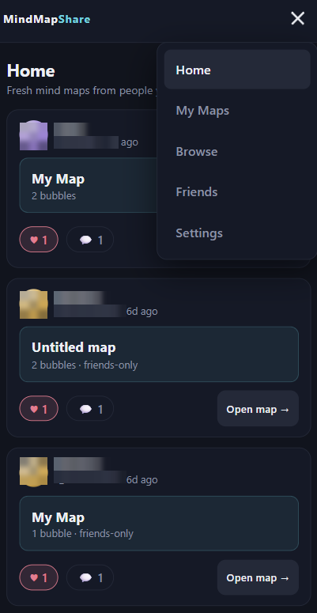

This view demonstrates that map browsing and navigation remain comfortable on a phone,
not just on desktop.

## What you can do

### Accounts, profiles & the social side
- Sign up with a username and password, add an optional display name, and choose whether
  it's shown to everyone or just friends.
- **Browse** and search everyone on the app; open anyone's profile to view their maps.
- **Friends** — send, accept, and decline friend requests. Friendship unlocks
  friends-only maps and is required before you can grant someone edit access.
- **Follow** — follow anyone (one-directional, like most social apps) to fill your feed.
- **Home feed** — your landing screen shows recent maps from people you follow (and your
  friends), newest first, with a **Discover public maps** section when your feed is thin.
- **Likes** — like any map you can view, from the feed or the read-only map view.
- **Comments** — any signed-in viewer can leave comments on a map from the read-only view
  (the 💬 Comments panel), the owner included. You can delete your own comments; the map
  owner can moderate any of them. Distinct from the editor-only collaboration chat.
- **Guests can see likes & comments** — signed-out visitors viewing a public map see its
  like count and can read the comments; posting a comment or liking prompts them to sign in.

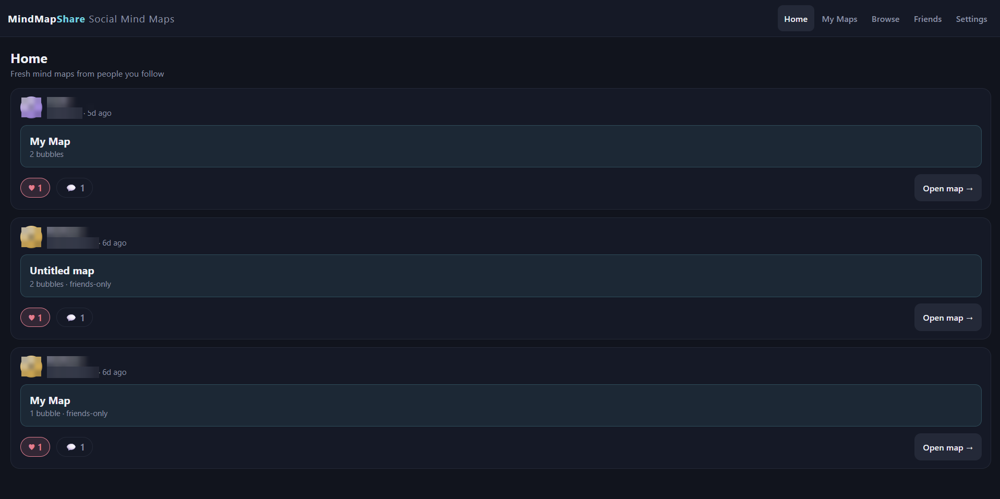

The home feed keeps users engaged with fresh activity from people they care about while
still helping them discover new public maps.

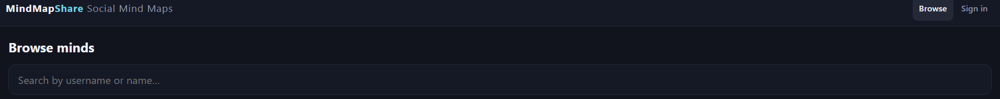

Browse and profile views make MindMapShare feel like a network, not just a single-player
tool.

### Multiple maps per account
- Keep several independent maps (e.g. "Work", "Novel ideas", "Trip planning"). Switch
  between them from the dropdown on the map screen; create one with **+ New**. Selecting a
  map **frames the whole thing** in view automatically.
- Each map has its **own name and its own privacy setting** — this is per-map, not a
  single account-wide toggle. Settings only sets the *default* privacy for new maps.
- From **Map ▾** you can rename a map, delete it (you always keep at least one),
  **duplicate** it (an independent private copy of its contents — no shared editors,
  chat, or likes carry over), and **reorder** your maps — **drag** the ⠿ handle (or use
  ↑ ↓) — so the dropdown lists them the way you want.
- **Save a copy of any map you can view** — from the read-only map view, **⎘ Save a
  copy** clones the map (your own or someone else's public/friends' map) into your **My
  Maps** as a fresh, private, fully editable copy, then opens it in the editor. The
  original owner isn't affected; no editors, chat, or likes carry over.
- **Map bubbles** — insert a map **as a bubble** with **🗺️ Map** in the editor — one of your
  own maps, or a map from **someone you follow**. It becomes an accent-ringed bubble (with a
  🗺️ badge) labelled after that map; when someone **viewing** the map taps it, they're taken
  to the linked map. Great for splitting a big idea into linked sub-maps, building an index
  map, or pointing at maps you follow.

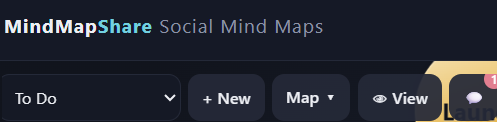

This flow highlights a key product advantage: one account can manage many distinct maps
without clutter or context switching pain.

### The Standing Desk — one work board per account

Open **Desk** in the top navigation. Every account has exactly one, and it starts
**private** — see *Sharing* below for the other two settings. Where maps are for developing
ideas, the desk is for tracking open work.

- **Two states.** Every item is either **Assigned to me** or **Waiting on others**.
  **Move to waiting** / **Assign to me** moves an item between them and **resets its
  last-updated date**, since a reassignment is the point from which the next wait is
  measured. **Mark updated** resets that date without moving the item — for when you
  followed up and the position hasn't changed.
- **Age is tracked, not guessed.** Each item shows the days since it was last updated. At a
  week it turns amber; after **14 days** it is flagged as stalled, with a red edge and a
  band reading *follow up or remove*. The **Stalled** figure in the header counts them, so
  an item that has quietly gone quiet stays visible.
- **A next step on every item**, edited in place. Left empty it is shown in red — an item
  with no next step is a note, not a commitment.
- **Completed work stays visible.** **Complete** takes an item out of the working columns and
  into a **Completed** list below them, newest first, where it stays until you **Delete** it.
  Nothing is counted or tallied — the finished items themselves are the record. **Reopen**
  puts one back where it came from with its clock restarted, so a mis-click costs nothing.
  A completed item is never counted in the header figures and never flagged as stalled.
- **A link to a mind map.** Items and reference entries can each point at one map — your own,
  or one shared with you to edit — chosen when you add them or attached afterwards with
  **Link a map**. Following the link opens that map in the editor. Only the map's id is
  stored, so the desk always shows its current name; if the map is later deleted or
  unshared, the link says so instead of failing silently.
- **One project or reference per item**, chosen from a dropdown of the ones already on the
  board so the same name is typed once and picked thereafter. **＋ New project or reference**
  turns the dropdown back into a text box for a name that isn't there yet.
- **Projects and owners can be changed afterwards.** Click the project shown on a card to
  move that item to another one, and **✎ Rename … on every item** renames the project itself
  everywhere it appears — open items and completed ones alike — so a project that gets called
  something else halfway through doesn't leave the board split between two names. On an item
  you are waiting on, the name beside it is edited in place: hand something off with **Move
  to waiting** and it reads *Unassigned* until you type who has it.
- **Reference** — short entries you refer to often (links, codes, contacts, targets, a map
  you keep reopening), edited in place and kept separate from the item list.
- **Working notes** — a ruled area at the foot of the board for thinking something through,
  with a formatting toolbar: **bold**, *italic*, underline, **Small / Normal / Large** text,
  **bulleted and numbered lists**, and **left / centre / right alignment**. Nothing in it is
  tracked or counted. Pasted text arrives as plain text, so formatting only ever comes from
  the toolbar.
- **As many notes as you need**, up to twenty. **+ Note** starts another; a tab strip across
  the top switches between them, and a note is renamed by typing over its own tab. Deleting
  one asks first if it has anything in it, and a board always keeps a note to write in — so
  deleting your last one leaves a clean one behind. The desk reopens whichever note you were
  last writing in.
- **Copy summary** puts the whole board on the clipboard as plain text: what is assigned to
  you, what you are waiting on and from whom (each with its age), what you have completed,
  and every note that has something in it, listed under its own name — bulleted lists keep
  their bullets, numbered lists keep their numbers, and line breaks land where they did on
  the board.

**Sharing.** The state of the board is shown in its header — click it to choose:

- **Private** — only you. The default, and where every desk starts.
- **Anyone with the link** — the board gets a secret code, and the link that carries it
  (`…/#/desk/<you>/<code>`) opens a read-only copy for anyone, signed in or not. **Generate a
  new code** revokes the old link immediately. Turning sharing off and on again keeps the same
  link working, so a link you have handed out doesn't break by accident.
- **Anyone** — readable by everyone and linked from your profile, no code needed.

A viewer sees the whole board — items, reference entries and every note that has something
in it — read-only, and can copy the summary. Links to maps a viewer can't open are left out of what they're sent,
rather than shown as something they can't reach.

Because a shared board's notes are rendered in someone else's browser, the markup is
rebuilt on the server rather than filtered: every tag kept is re-emitted from a short
allowlist carrying only a `class` drawn from a second allowlist, and everything else is
dropped. Nothing a client sends is echoed into markup, so the worst a hostile payload can
do is come back as visible text.

Everything autosaves as you type, and the board is included in **⤓ Export my data**.
Deleting your account deletes it along with everything else.

### Privacy — friends-only maps are truly hidden
- A map set to **Friends only** is invisible to anyone who isn't your friend: not listed
  on your profile, not counted in your totals in Browse, and it can't be opened by URL —
  to a stranger it's as if the map doesn't exist.
- A **Public** map is viewable (read-only) by everyone; a **Private** map is yours alone
  (plus anyone you've granted edit access).
- Being able to *view* a map never implies being able to *edit* it — see below.

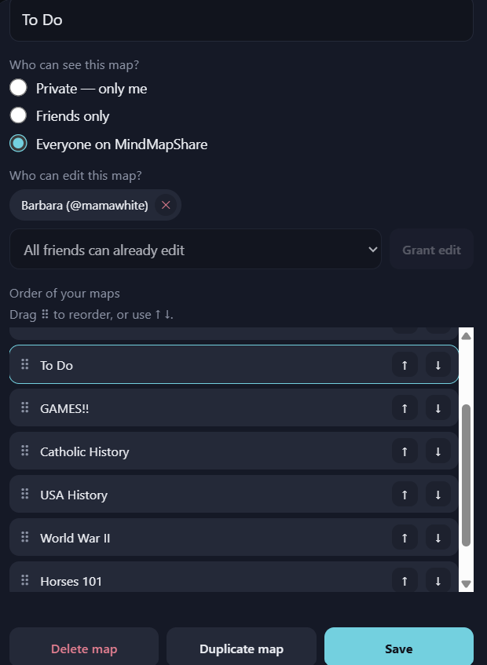

Privacy is configured at the map level, so users can publish some ideas, keep others to
friends, and keep sensitive work private.

### Building a map
- **2D bubbles** — a flat, pannable canvas. Tap a bubble to select it, tap again to
  rename, drag to move. Drag the background to pan, pinch or scroll to zoom, and use
  **⌖** to fit the whole map on screen.
- **Notes, links & tasks** — every bubble (and group) can carry a free-text **note**, an
  optional **link** (a web address), and a **✓ done** flag for tracking tasks. Notes and
  links show as small badges; done bubbles are dimmed with a struck-through label.
- **Weighted connections** — select a bubble, tap **+ Connection**, then tap another.
  New links start at weight 1 (a thin line); tap a line (or its numbered dot) for a
  slider to make it thicker (1–10 — the weight *is* the thickness) or remove it.
- **Groups** — **+ Group** creates a container bubble. Add bubbles inside it (select the
  group, then **+ Bubble**), or move bubbles in and out with **Group ▾**. Grouped
  bubbles can still link to bubbles outside the group.
- **✨ Tidy** — automatically spreads the whole map into a clean, evenly-spaced layout and
  fits it to the screen.
- **☰ Outline** — the map as a collapsible text tree, with note/link/done markers and notes
  shown inline beneath their item. Click a row to focus that node on the canvas. Available
  both while editing and when **viewing** a map read-only (on someone's profile or your own
  preview), where clicking a row centers the view on that bubble instead.

  **Editing from the outline** *(owner and anyone granted edit access)*: each row carries
  **✎ Edit** (label, notes, link — the same sheet the canvas uses), **＋** to add a sub-item
  beneath it, **🗑** to delete it, and a **checkbox** to tick it off as you study. The
  **+ Topic** and **+ Group** buttons at the foot of the panel add top-level items. Adding a
  sub-item to a plain bubble turns it into a group, because in a mind map an idea with
  sub-ideas *is* a group — so outlines nest as deep as you need. Every edit autosaves and
  broadcasts to anyone else on the map exactly like a canvas edit.

  **Rearranging** *(owner only)*: drag the **⠿** handle, or use **↑ / ↓**, to reorder items
  within their level. The order is stored per item and is independent of where bubbles sit
  on the canvas, so you can arrange a study sequence without disturbing the layout — and
  every **export** follows it.

  **Export** the outline with the ⤓ button as **PDF** (a vector picture of the map plus the
  full outline, via the browser's Save-as-PDF), **Markdown**, **plain text**, or **OPML**
  (for other outliners).
- **✨ AI** *(when enabled)* — describe what you want and AI builds grouped, connected ideas
  for you to refine, two ways: **Begin new map** generates a fresh map that *replaces* the
  current contents, or **Add to map** reads the existing map as context and *expands* it —
  new ideas are added beside what's there (nothing removed) and can connect to your existing
  bubbles. The button appears only when the server has an Anthropic API key configured (see
  below).
- **Overlap picker** — hovering highlights exactly what a click will select. When things
  stack up, hover for a second (or double-tap on mobile) for a dropdown listing
  everything under the cursor.

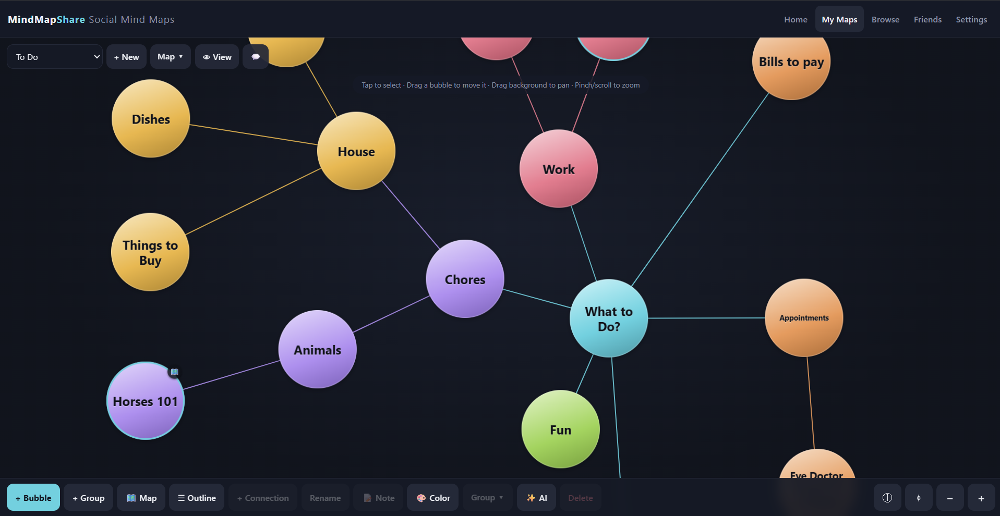

The core canvas emphasizes clarity: users can quickly see structure, relationships, and
priority at a glance.

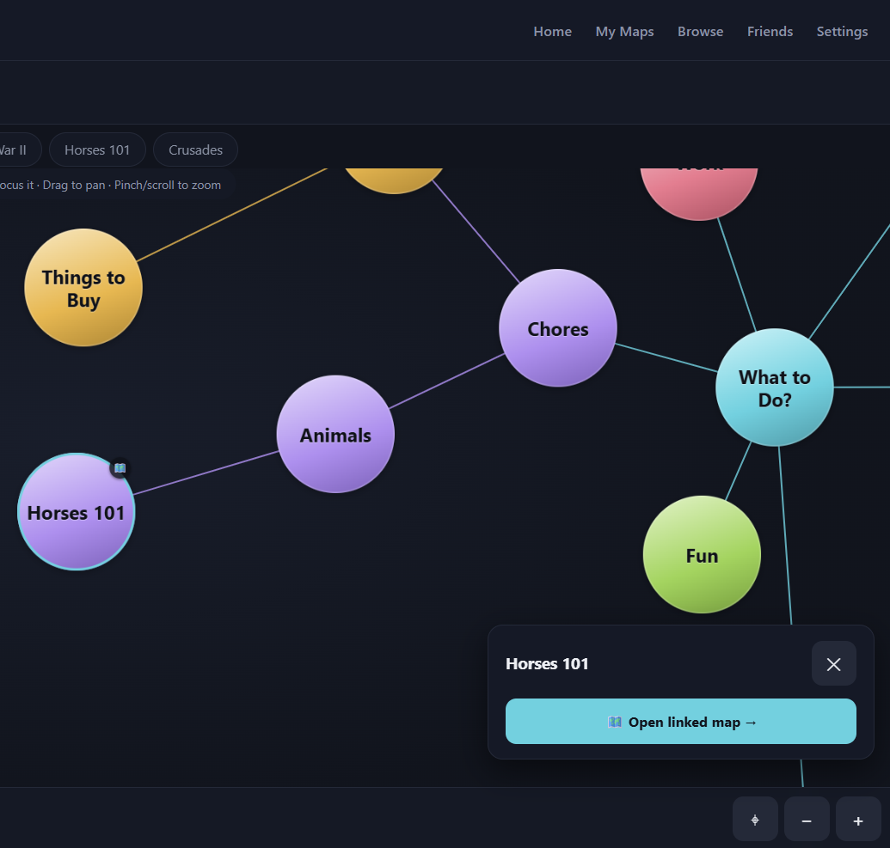

Fast creation and mind map linking make brainstorming feel fluid while preserving signal
about which connections matter most.

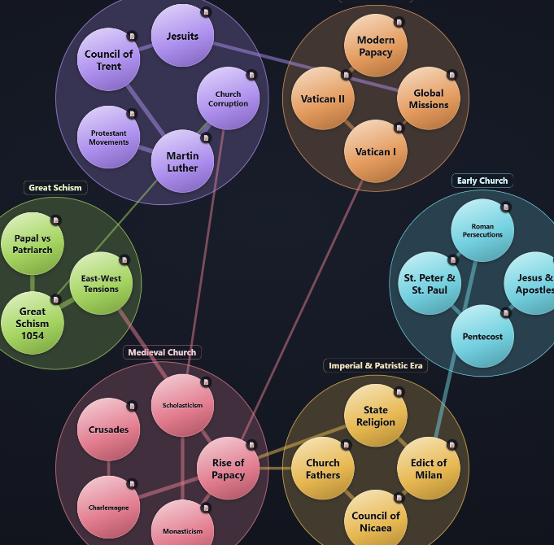

Groups help large maps stay readable by clustering related ideas without sacrificing
cross-group connections.

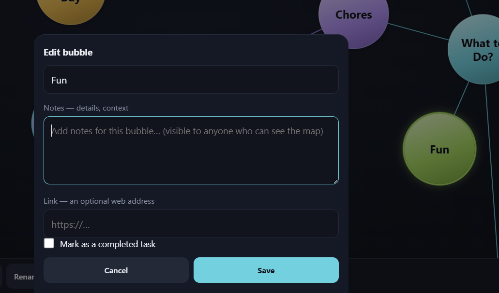

Notes, links, and task markers turn a visual map into an actionable workspace.

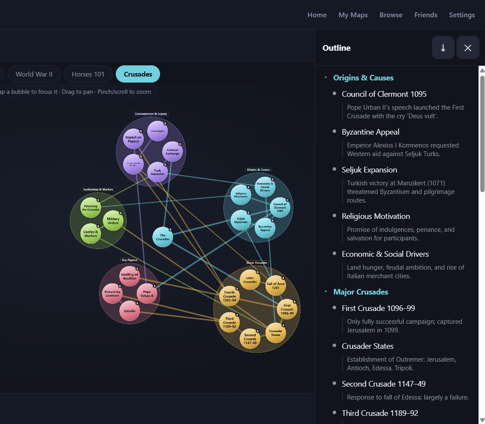

The Outline view complements the canvas for users who prefer hierarchy and quick scanning
of nested ideas.

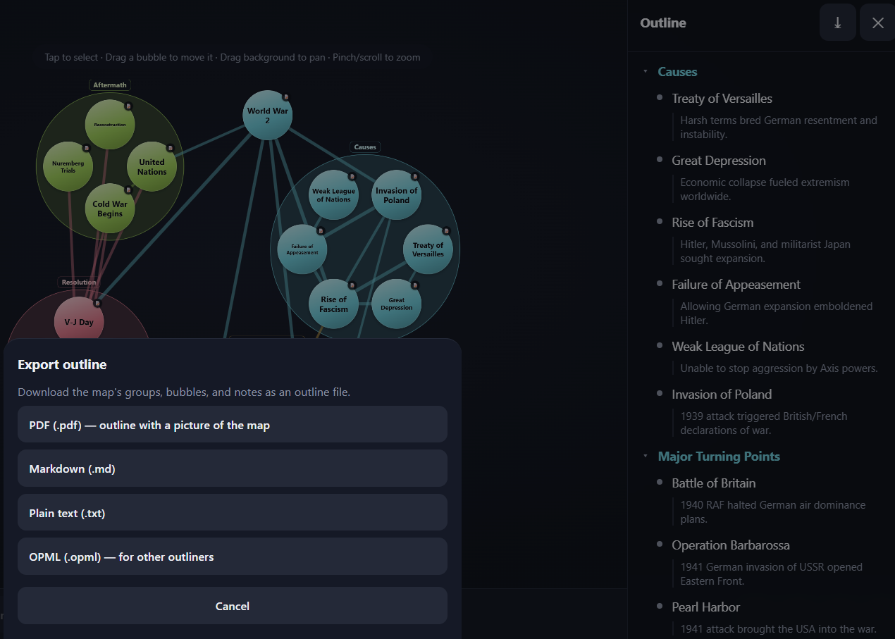

Export options make maps portable for docs, planning workflows, and external knowledge
tools.

### Sharing & real-time collaboration
- **Grant edit access** to friends from **Map ▾ → "Who can edit this map?"**. Maps shared
  with you appear in your map dropdown under **Shared with me**.
- **Only the owner** can rename a map, change its privacy, manage editors, or delete it.
  Editors change contents but not settings — all enforced on the server.
- **Preview** your own map as visitors see it — the read-only view a stranger or follower
  gets — without leaving the editor.
- **Live updates** — when two people have the same map open, edits (including notes,
  links, and task toggles) appear on everyone's screen within a moment, without disturbing
  their pan, zoom, or the bubble they're dragging. A small "**\_\_\_ others here**"
  indicator shows who else is viewing.
- **Chat & activity log** (the 💬 panel) — collaborators can chat, and every change is
  recorded as an attributed, timestamped line — bubbles added/renamed/deleted, notes
  added/edited/removed, tasks completed/reopened, moves in and out of groups, and
  connection changes. The history saves with the map and survives restarts; an unread
  badge appears when new activity arrives while the panel is closed.

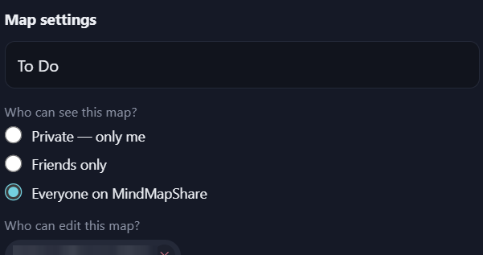

Sharing permissions give owners confidence: collaboration is easy to grant and easy to
control.

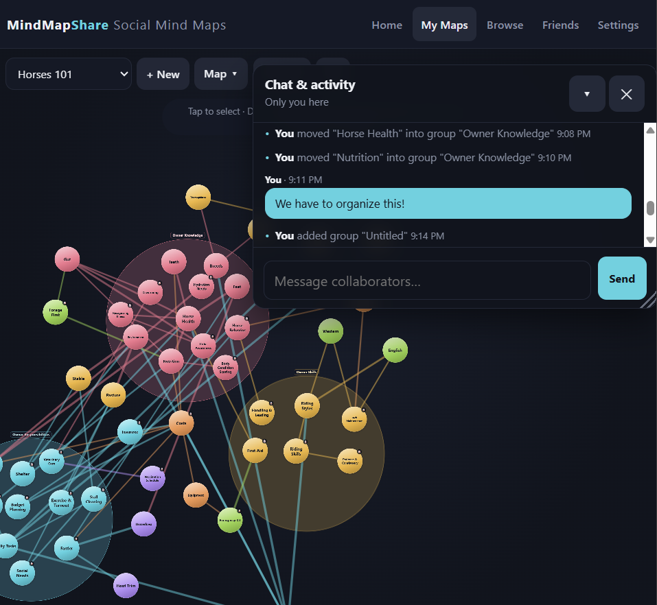

Real-time updates plus chat reduce coordination overhead for teams working in parallel.

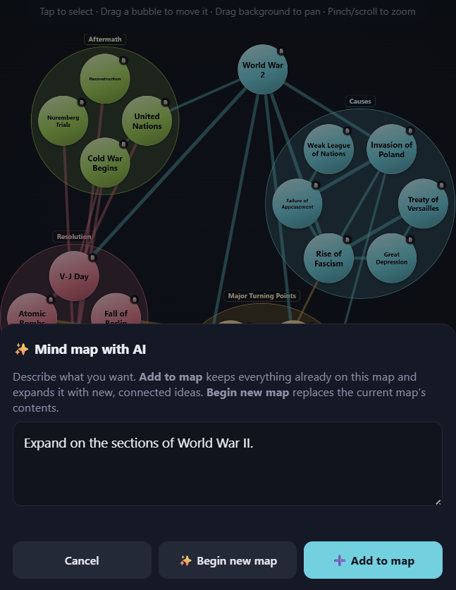

AI generation accelerates the blank-page moment by producing a first draft users can
immediately refine. You can also have the AI add to your ideas and build off them.

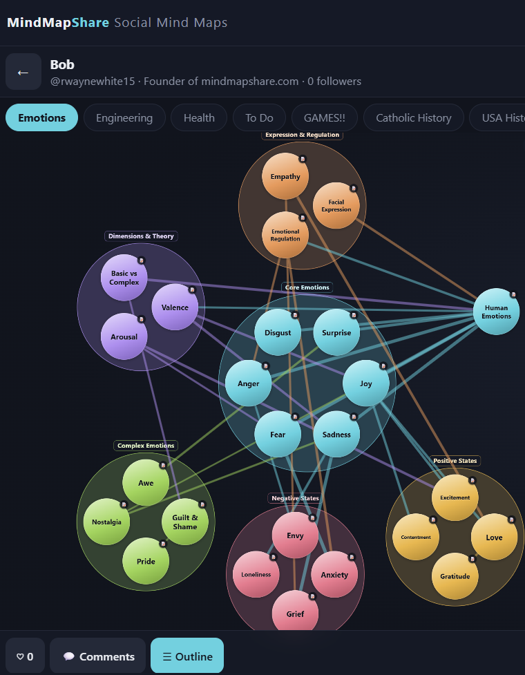

Read-only previews let creators publish and present maps safely without exposing edit
controls.

  > Concurrency is **last-write-wins** — great for people working on different parts of a
  > map at once; two people editing the *same* bubble in the same instant can overwrite
  > each other. There is no operational-transform merging.

## Deploy to the internet (Render + Neon)

The server automatically uses **Postgres** when a `DATABASE_URL` environment variable is
present, so production deployment is configuration, not code:

1. **Neon** (<https://neon.tech>): create a project, copy the connection string.
2. **GitHub**: push this repo.
3. **Render** (<https://render.com>): New → Web Service → connect the repo.
   - Build command: `npm install`
   - Start command: `node server.js`
   - Environment variables:
     - `DATABASE_URL` = your Neon connection string (enables Postgres persistence)
     - `ANTHROPIC_API_KEY` = an Anthropic API key *(optional — enables the ✨ AI button)*
     - `ADMIN_PASSWORD` = a long random secret *(optional — enables the admin console at `/admin`)*
4. **Custom domain** (e.g. `MindMapShare.com`): in the Render service → Settings → Custom
   Domains, add your domain and set the DNS records Render shows. HTTPS is automatic.

Tables are created — and existing data is migrated — automatically on first boot.
Sessions get the `Secure` cookie flag behind HTTPS, and login/registration are
rate-limited per IP.

> **Persistence note:** without `DATABASE_URL` the server stores data in a JSON file on
> local disk, which is **ephemeral** on hosts like Render (wiped on each deploy/restart).
> Set `DATABASE_URL` in production so accounts and maps survive.

### AI map generation

Setting `ANTHROPIC_API_KEY` turns on the **✨ AI** button. Generation calls the
[Anthropic API](https://console.anthropic.com) (`@anthropic-ai/sdk`, model
`claude-opus-4-8`) to turn a prompt into groups, nodes, and weighted edges. **Begin new
map** replaces the current map; **Add to map** sends the existing map as context and the
model returns only additions, which are merged in beside your current content (new bubbles
can even connect to existing ones). Without the key the app runs normally and the button
stays hidden. Requests are rate-limited per user.

Map generation is the **only** thing the key is used for.

### Admin console

Setting `ADMIN_PASSWORD` turns on an admin dashboard at **`/admin`**, separate from
normal user accounts. Sign in with the password to see site-wide stats (total users,
maps, and nodes, plus recent sign-ups), browse and filter every account, and delete
users (which scrubs all their friend/follow links and shared-map grants). The admin
session is a short-lived, HttpOnly signed cookie — the signature is keyed by
`ADMIN_PASSWORD` itself, so rotating the password immediately invalidates every open
admin session and nothing is stored server-side. Sign-in attempts are rate-limited per
IP. Leave `ADMIN_PASSWORD` unset and both the page and its API stay disabled.

### Live collaboration behind a proxy

Real-time updates use **Server-Sent Events** (one long-lived HTTP connection per open map,
plus one per signed-in user for the notification bell). A reverse proxy must not buffer or
prematurely close the stream — the server sends the `X-Accel-Buffering: no` header and a
25-second heartbeat to keep connections healthy through common proxies (nginx, Render).

Presence and stream membership are **in-memory** per process, so running multiple workers
would need a shared bus (Redis) before live collaboration could span them; a single web
service handles the current scale fine. Everything durable — maps, chat, comments, likes —
lives in the database.

### Schema migrations are automatic and safe

On boot the Postgres backend adds any missing columns with `ADD COLUMN IF NOT EXISTS`
(including the `following`/`followers` follow graph, the `desk` board, and the
`plugin_data` bag installed plugins write to) and runs a
**one-time, idempotent**
migration that wraps each legacy single-map account into the multi-map shape. It only
*reads* the old `map` column to build the first entry of the new `maps` array — it never
drops or overwrites existing bubbles, and re-running it is a no-op. Notes, links, tasks,
likes, and chat/activity history all ride along inside the map JSON, so no schema change
is required for them.

## The toolbar and the feature library

Every screen in this app is optional, and an account starts with none of them. What the
top navigation holds is a list the account chose — in the order it chose — and the
**Features** library is where that list is built.

The library shows everything this server can offer: the built-in screens, and any
installed plugin alongside them, marked as an add-on. **＋ Add** puts one in the toolbar,
**↑ / ↓** order it, **Remove** takes it out.

Two entries are always there and cannot be removed: **Features**, so the toolbar can
always be changed back, and **Settings**, so an account can always be managed and signed
out of. An account whose toolbar is empty opens on the library.

**Removing a feature removes a shortcut, not access.** Its screen still opens from a link —
a map someone shared, a desk sent by code, a bookmark — and nothing it holds is touched.
Turn it back on and everything is where it was. That also means an add-on that gets
uninstalled from the server keeps its place in the list: it simply isn't drawn until it
is installed again.

The choice lives on the account, so it follows you between devices, and it is part of
**Export my data**.

## Plugins

Some things belong to one trade rather than to everybody. A plugin is how those get
added: a folder you put in `plugins/`, read once at startup, that contributes **an entry
in the feature library**, **its own API namespace**, **private per-account storage**, and —
if it wants them — **shareable documents**, which get the same owner, privacy tiers,
invited editors, live channel, chat and feed cards the mind maps have, without the plugin
implementing any of that. And nothing else: it cannot reach the map editor, the desk, or
another plugin's data. Installing one makes it available; each account still decides
whether to put it in its own toolbar.

Nothing ships enabled. With an empty `plugins/` folder — the default — the app is exactly
what it is without the plugin system, and `/api/plugins` answers with an empty list.

### Installing one

```bash
node tools/install-plugin.js manufacturing            # a package that ships with this repo
node tools/install-plugin.js ~/Downloads/plugin.zip   # one that was downloaded
node tools/install-plugin.js ~/Downloads/plugin/      # one already unzipped
node tools/install-plugin.js --list                   # what is installed
node tools/install-plugin.js --remove manufacturing   # take one back off
```

Then **restart the server** — plugins are read at startup. An installed plugin appears in
the **Features** library; each account adds it to its own toolbar from there. Installing is only ever "put
the folder in `plugins/`"; the installer adds the checks worth doing first: that the
package really is a plugin, that its manifest names files it actually ships, and that a
downloaded archive writes nothing outside the folder it claims.

`plugins/*` is gitignored, the way `node_modules` is: an installed plugin came from a
download and is reinstalled rather than committed. On a hosted deployment, add
`node tools/install-plugin.js <name>` to the build command, or commit the folder
deliberately with `git add -f plugins/<id>`.

**A plugin's `server.js` runs inside the server process, with everything that process can
reach**, and its client code runs on the page alongside the app. Install ones you trust,
from where you meant to get them.

### Shopwatch — the first plugin

A cycle-time stopwatch for the shop floor. **Start** when the tool goes in, **Cycle done**
at the end of each part — each press records the split since the last one, so a run of
parts gives a run of cycle times without stopping the watch. A time measured elsewhere is
typed straight in as `42.6` or `1:23.4`. **Mark in cut** records how much of a cycle the tool
actually spends in the material — pressed as it enters and again as it leaves, as many times as it
does so — which is the cutting time the tool life is worked out from and the one thing a cycle time
cannot tell you afterwards. **Tool done →** records against the tool that just
finished cutting and moves the watch straight to the next tool in the op without stopping, so one
pass down an operation measures every tool in it — past the last it comes back to the first, which
is one part. At a laptop, <kbd>Space</kbd>, <kbd>L</kbd>, <kbd>N</kbd> and <kbd>R</kbd> start/stop,
mark a cycle, move to the next tool and reset.

**A shopwatch is one floor**, and an account keeps as many as it needs — one per cell, one
per building, one to try something in — with a switcher at the top to move between them. A
new one is private until its owner shares it, and sharing asks two questions separately:
**who can open it** (private, friends, or everyone) and **who can change it** (named
usernames, which override the tier — that is how a private shopwatch reaches the one person
setting the job). Everybody else who can open it gets it read only, and can **save a copy**
into a shopwatch of their own — and **Duplicate** does the same for one of your own, standing a
second shopwatch up with the whole floor in it. A link to an **Everyone** shopwatch opens for
somebody with **no account at all**, read-only, the same courtesy a public map gets: they see the
whole floor and none of the controls that would change it. Two people in the same one see each other's edits live, the
💬 chat is shared by everyone who can open it and logs the edits as they happen — *timed
80° CNMG rougher at 00:33.3 on HAAS ST-20* — and a shared shopwatch gets a feed card saying
what is in it. None of that is implemented in the add-on: it is the host's document
facility, the same one described under [Writing one](#writing-one).

**A cycle time is only ever true of one tool, on one machine, doing one operation**, and
the record is shaped that way. A **part** carries its **operations**, and an operation
belongs to exactly one part — that is what an op is, a step in making *that* part. A
**tool** carries what is true of it wherever it runs: its own **part number**,
**description** and **cutting edges**, plus an optional cost, kept once in the crib.
**Setting a tool up** on a machine for one of those operations carries what is true only
of that combination: the **indexable edges** used there, the **parts per index** it lasts,
and the station and seq it sits in — along with every cycle timed against it.

So tools and machines are many-to-many — a tool runs on as many machines as it is set up
on, a machine holds as many tools, neither owns the other — and the same tool in the same
machine cutting a different op is a different setup with its own times. A rougher
that spends 38 seconds in cut on Op 20 and 12 on Op 10 is one tool with two setups, not two
tools. From those numbers:

```
parts per tool     = parts per index × indexable edges
minutes per edge   = parts per index × time in cut ÷ 60
tools / 100 parts  = 100 ÷ parts per tool
cost per part      = tool cost ÷ parts per tool
```

Cutting time is measured, never typed: there is nowhere to enter what a tool *should*
spend in cut, because a typed number and a measured one are two answers to one question
and only one of them is evidence. The floor reads from three ends, narrowed by one filter box: **Parts and
operations** lists each part with its ops, and each op with the machines it runs on and
what they measure; **Machines** lists each machine with the tools on it, grouped by the
operation they are set up for and in the order they cut; **Tools** lists the crib, each
tool with the machines it runs on as chips. Deleting a machine leaves its tools in the
crib, deleting a tool takes it out of every setup, and deleting an operation takes the
setups that were for it — the cycles timed belong to the op.

**Clone** on a machine stands a second one of the same kind up beside it: the next number
after its name is suggested, and saving copies the tools across in the stations they sit
in. Only the tools by default — a tool cutting three ops on the original arrives once, on
no operation, because which ops the new machine runs is its own business and the tool life
belongs to the op being cut. **Bring the operations too**, on the clone
form, copies each setup whole instead: same op, same tool life, with the
op then listing both machines. The recorded cycles stay with the original either way.

**Clone** on a part number does the same for a revision, and copies the whole route: every
operation of the part and every setup on them — the same tools, on the same machines, in
the same stations, with the tool life worked out for them. A revision
letter takes the next letter (`12345-A` suggests `12345-B`), a trailing number takes the
next number. None of it is optional the way a machine's operations are: which ops a machine
runs is a decision about the machine, but the ops that make a part are what the part is.
The cycles stay with the original, which was the one actually cut.

Every heading folds. The three lists close, and so does each part and each machine inside
them, with the counts and the **+** buttons staying on the closed heading — which is what
makes a floor of a dozen machines readable on a phone. Folds live on the device, not in the
shop record, and a filter opens everything so a search is never answered by a closed
heading.

Setups run in **sequence order** within a machine and an operation — a newly set-up tool
takes the next number, ↑ / ↓ move it, and the op renumbers itself so the sequence is
always 1..n. The **Op cycle** panel sums the tools' averages into that op's real cycle
time on that machine and draws a stacked bar dividing it between them in the order they
cut, each segment sized by its share. The table beneath the bar is the legend and the
numbers at once, and hovering or tabbing to either half lights up the other. Segment fills
step along one cyan ramp light→dark with the running order — validated for monotone
lightness, adjacent step separation, single hue, and a darkest step that still clears the
dark chart surface — so the order reads in the color rather than in eight unrelated hues.
Tools with nothing timed yet are listed as **not timed**, with a line saying how many,
because the total is what has been measured rather than a finished op.

Under it, **In cut, and the waste** answers the other question: how much of each tool's
cycle is making chips. It is one column per tool, side by side — the column is that tool's
measured cycle, and only the time marked in the cut is filled in, so the empty top of each
column is the waste. One scale across the op makes the columns comparable to each other,
and the figure above the plot is the op's own share. The fill is the in-cut hue and the
unfilled part a dark step of the same hue — checked as an ordinal ramp against the panel
for monotone lightness, a visible step gap, one hue and a dark end that still clears the
surface — with a 2px gap in the panel colour between them rather than a border. The most
and least cut columns are labelled; every other number is in the table beneath, which is
also the accessible twin of the plot. A tool with cycles timed but nothing marked in cut is
drawn as an outline with nothing in it and listed as **not marked**, never as a column of
waste: its share is a measurement nobody took, not zero.

Each tool's column and its fill are averaged over the **same** cycles — the ones actually
marked in and out. Averaging the fill over the marked cycles and the column over all of
them would let a mostly-unmarked op draw a fill taller than the column holding it.

**⤓ Export** downloads every recorded cycle, one row each, carrying the part, the op, the
machine, the tool and the setup between them, ordered the way the floor runs — plus a row
for a part with no ops, an op nothing is set up for, a tool in the crib and an idle
machine. **⤒ Import** reads one back in the same shape, so a file that came out goes back
in unchanged, and a tool list already kept in a spreadsheet comes in by putting those
headers on it. Columns are read by name rather than position, common alternatives are
understood, each record that can carry notes has its own notes column, files written by
earlier versions of the add-on still read, and the worked-out columns are ignored on the
way in. An import never deletes anything: it shows what it would do first, matches parts by
number, operations by name within the part, machines by name, tools by part number and
description, and setups by the three they join plus the station, and recognizes cycles by
when they were recorded — so importing the same file twice adds nothing the second time.

Existing records are converted the first time they are read, in two steps. Version 1 kept
one flat row per tool with the machine as a field on it: each becomes a machine, a tool and
the setup between them, and the same tool met on two machines collapses into one crib entry
with a setup on each. Tool life given in minutes per edge becomes parts per index at the
measured cycle; where nothing was timed there is nothing to divide by, so the old figure
goes into the notes rather than becoming a number nobody measured. Version 2 kept the part
and the op as text repeated on every tool of the job: they become records, with each setup
naming the operation it is for. Full details in
[`plugin-packages/manufacturing/README.md`](plugin-packages/manufacturing/README.md).

### Writing one

A plugin is a folder with a `plugin.json`:

```json
{
  "id": "manufacturing",
  "name": "Shopwatch",
  "version": "1.0.0",
  "description": "What it is, in a sentence.",
  "hostVersion": 2,
  "nav": { "label": "Shopwatch" },
  "client": "client.js",
  "styles": "client.css",
  "server": "server.js"
}
```

| Field | What it does |
|---|---|
| `id` | Lowercase letters, numbers and dashes; must match the folder name. It is the URL prefix for both the plugin's assets and its API. |
| `nav.label` | The name it carries in the feature library, and in the toolbar of any account that adds it. The screen lives at `#/p/<id>`. |
| `client` / `styles` | Files inside the plugin's `public/`, served at `/plugins/<id>/…` and loaded by the shell on boot. |
| `server` | Optional. A module mounted under `/api/plugins/<id>/…`. |
| `hostVersion` | The plugin contract it was written against. A plugin needing a newer host than the server implements is refused at startup rather than half-working. |

An add-on that keeps only documents needs no routes at all: return `docs` without a `handle`
and the host serves everything — Shopwatch does exactly that, and
`/api/plugins/manufacturing/…` answers 404 for anything outside the document routes.

The client script registers a screen as it loads:

```js
window.MindMapPlugins.register({
  id: 'manufacturing',
  mount(section, ctx) { /* build the screen once, into the section given */ },
  open(sub, ctx) { /* entered or re-entered; sub is the path after #/p/<id>/ */ },
  leave() { /* navigating away — flush a pending save */ },
});
```

`ctx` is the whole of what a plugin gets from the shell: `ctx.api(path, method, body)` for
its own routes, `ctx.me()` for who is signed in, `ctx.go(sub)` to move around inside its
own screen.

The server module is a factory, called once at startup:

```js
module.exports = ctx => ({
  async handle(req, res, sub, user) {
    if (req.method === 'GET' && sub === '/') {
      ctx.sendJSON(res, 200, { thing: ctx.data.get(user) });
      return true;             // handled
    }
    return false;              // not ours — the host answers 404
  },
});
```

Sign-in is already enforced before `handle` runs, so `user` is always a signed-in account,
and the CSRF check every other write route gets applies here too. `ctx.data.get(user)` and
`ctx.data.save(user, value)` are one JSON value per plugin per account, kept on the user
record — persistence without a storage backend of the plugin's own, on Postgres and on the
local JSON file alike. It rides along with **Export my data** and is deleted with the
account, and it survives the plugin being removed and reinstalled.

**Documents — sharing, without writing any of it.** One JSON value per account is enough
for a private tool, and nothing more. A plugin whose thing is worth handing to somebody
else exports a `docs` contract instead, and the host owns the envelope: who a document
belongs to, its name, its privacy tier, who is invited to edit it, its chat, its live
channel, its feed card, and every permission check on all of that.

```js
module.exports = ctx => ({
  docs: {
    empty: () => ({ rows: [] }),               // a new one
    sanitize: body => rebuild(body),           // never trust what arrives
    summary: body => body.rows.length + ' rows',   // one line, for the feed card
    limits: { maxRows: 500 },                  // handed to the client as-is
  },
});
```

`sanitize` is the only guard the plugin has to write, and it is the one it cannot delegate:
the host decides *who* may write, the plugin decides *what* a stored body may contain. It
runs on every read and every write, so a body that arrives from an invited editor is
rebuilt exactly like one from the owner. `handle` is still optional and still available
alongside `docs`, for routes that are not about a document.

In return the host mounts these under `/api/plugins/<id>/docs`, before the plugin's own
`handle`:

| Route | What it does |
|---|---|
| `GET /docs` | Every document this account owns, plus the ones shared with it |
| `POST /docs` | Make one — `{ title, body? }`. It starts **private** |
| `GET /docs/<id>` · `PUT /docs/<id>` | The body, sanitized both ways. `PUT` needs edit rights |
| `PUT /docs/<id>/meta` | Name and privacy tier — owner only |
| `GET` · `PUT /docs/<id>/editors` | Who may change it, by username. Anyone who can open it may see the list; only the owner may set it |
| `GET` · `POST /docs/<id>/chat` | What has been said about it. Readable by anyone who can open it, writable by anyone who can edit it |
| `GET /docs/<id>/live` | SSE: presence, edits, chat and meta changes as they happen |
| `POST /docs/<id>/copy` | Take a private copy of one you can see |
| `DELETE /docs/<id>` | Owner only, and it takes the chat with it |

A document is visible to its owner, to anyone invited to edit it, and to whoever the tier
allows — friends, or everyone. Anything else answers **404**, not 403: a private document
does not admit to existing. Writes by somebody who may read but not edit answer **403**.
Friends-and-public documents appear in the feed alongside maps, with `summary` as the card
text, and the usual notifications go out. Caps are the host's: 40 documents per account per
plugin, 20 editors and 400 chat messages each.

This is `hostVersion: 2`. A plugin exporting `docs` needs a host that implements it, and
says so in its manifest; an older server refuses to load it at startup rather than
half-working. `GET /api/plugins` reports each plugin's `docs` flag and the host's version.

Package one for distribution with `node tools/package-plugin.js <name>`, which writes
`dist/mindmapshare-plugin-<id>-<version>.zip` — that file is the whole download.

## Files

| Path | What it is |
|---|---|
| `server.js` | Node server: accounts, sessions, friends & follows, multi-map storage, the Standing Desk, likes, feed, comments, notifications + Web Push, live SSE + chat, AI map generation, the plugin host and its shared documents, static files |
| `public/` | The web app (HTML/CSS/JS, no build step) |
| `plugins/` | Where installed plugins go. Empty by default; contents are not committed |
| `plugin-packages/` | Plugin source that ships with this repo, ready to install or package |
| `tools/` | `install-plugin.js`, `package-plugin.js`, and the small zip reader/writer they share |
| `data/data.json` | Local-mode user data (created on first run; not used with `DATABASE_URL`) |
| `.env.example` | Template for running locally against Postgres |
| `start.bat` | Windows launcher: starts the server and opens the app |
| `legacy-index.html` | The original single-user prototype, kept for reference |

Passwords are stored salted and hashed (scrypt). Sessions are HttpOnly cookies. The only
runtime dependencies are `pg` (used only with `DATABASE_URL`) and `@anthropic-ai/sdk`
(used only when `ANTHROPIC_API_KEY` is set); both are loaded lazily, so the app runs
without either configured.
