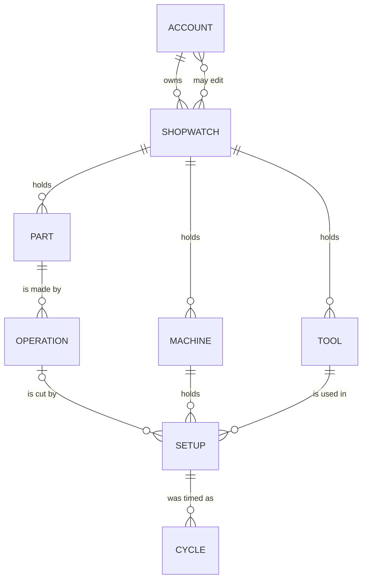

# Shopwatch — a MindMapShare plugin

A cycle-time stopwatch for the shop floor, over the records the times belong
to: the parts being made and their operations, the machines, and the tool crib.

**A cycle time is only ever true of one tool, on one machine, doing one
operation.** That is the shape of the record:

- a **tool** carries what is true of it wherever it runs — its own part number,
  what it is, how many cutting edges it has, and optionally what it costs
- a **part** carries its **operations**, and an operation belongs to exactly one
  part, because that is what an op is: a step in making *that* part, not a name
  that means the same thing everywhere
- **setting a tool up** on a machine for one of those operations carries what is
  only true of that combination: the **cutting time**, how many of the tool's
  edges are **indexed through** there, and how many **parts run between one index
  and the next** — along with every cycle timed against it

So a tool runs on as many machines as it is set up on, a machine holds as many
tools, and the same tool in the same machine cutting a different operation is a
different setup with its own cutting time. Time enough cycles and the record
answers the questions that are actually asked at the machine:

- how long the op really takes, on average, at best, and how far it spreads
- how much of the measured cycle is actually cut
- how long an edge lasts in minutes of cut, at the parts it runs between indexes
- how many parts a whole tool covers, how many tools a hundred parts consumes,
  and what they cost per part
- and, across the op's tools in the order they cut, **where the cycle actually goes**

## Installing

This plugin is not part of MindMapShare. It is downloaded separately and put in
the app's `plugins/` folder:

```bash
node tools/install-plugin.js manufacturing            # from a copy that ships it
node tools/install-plugin.js ~/Downloads/plugin.zip   # from a download
```

Restart the server. **Shopwatch** then appears in the **Features** library, next
to the built-in screens; add it there and it joins your toolbar. Without it
installed, nothing about the app changes.

The folder and the plugin id are still `manufacturing`: the id is the URL prefix
for its API, and it is what every saved shopwatch is filed under, so renaming it
would orphan every one already saved. Only the name on screen is Shopwatch.

It needs a host that speaks **plugin contract v2** — the version that owns
documents, sharing and the live channel on an add-on's behalf. An older host
refuses to load it and says so at startup rather than half-installing it.

To take it off again: `node tools/install-plugin.js --remove manufacturing`.
Shopwatches stay on each account and come back if it is reinstalled — as does its
place in anyone's toolbar, which is kept rather than quietly dropped.

## Using it

**Start a shopwatch.** A shopwatch is one floor: its parts and their operations,
its machines, its tool crib, and every cycle timed against them. An account keeps
as many as it needs — one per cell, one per building, one per customer, one to
try something in — and the switcher at the top of the screen moves between them.
A new one is **yours and private** until you say otherwise.

Everything below happens inside the open shopwatch. Nothing crosses from one to
another except by [saving a copy](#sharing-a-shopwatch) or by exporting a
spreadsheet out of one and importing it into another.

**Add a part**, and give it the operations that make it:

| Field | What it is |
| --- | --- |
| Part number | The part being made, not the tool: `12345-A` |
| Description | What it is: "pump housing" |
| Operation | What the traveller calls the step: `Op 20` |
| Step | Where that op falls in making the part — 1 runs first |

**Add a machine.** A name is all it is: whatever it is called on the floor.

**Add a tool.** A tool is described once, however many machines it ends up on:

| Field | What it is |
| --- | --- |
| Part number | The tool's own number — what it is ordered by: `CNMG432-MP` |
| Description | What it is: "80° CNMG rougher" |
| Cutting edges | Usable cutting edges the tool has — 4 on a CNMG insert |
| Cost | Optional — what one costs, for cost per part |

**Set it up.** This is where the tool, the machine and the operation meet, and it
is the thing the shopwatch times:

| Field | What it is |
| --- | --- |
| Tool | Which tool from the crib this is |
| Machine | Which machine it is running on |
| Operation | Which op of which part it is cutting |
| Station | Turret position or pocket: `T0303` |
| Seq | Where the tool falls in that op's running order — 1 cuts first |
| Cutting time | Seconds in cut on one part, on this machine and this op |
| Indexable edges | How many of the tool's edges get indexed through here |
| Parts per index | Parts run between one edge index and the next |

The same tool set up for a second operation gets its own cutting time, its own
edges and its own tool life there — which is the point. A rougher that spends
38 seconds in cut on Op 20 and 12 on Op 10 of the same part is one tool with two
setups, not two tools; the same is true of the same op on a second machine.

Leaving **indexable edges** blank means every edge the tool has. Adding a part
leads straight into its first operation, adding an operation into setting a tool
up for it, and adding a machine or a tool into setting that up too — because a
part with no ops, a tool on no machine and a machine with no tools are all
records that cannot tell you anything yet.

**Time it.** **Start** when the tool goes in, **Cycle done** at the end of each
part. Each press records the split since the last one, so a run of parts gives a
run of cycle times without stopping the watch. **Reset** zeroes the display and
keeps every recorded cycle.

At a laptop, <kbd>Space</kbd> starts and stops, <kbd>L</kbd> marks a cycle and
<kbd>R</kbd> resets. A time measured somewhere else is typed straight in as
`42.6` or `1:23.4`.

The watch keeps time from the clock rather than counting up, so a phone that
sleeps mid-cycle, a backgrounded tab and a page reload all come back reading
correctly.

**Read the numbers.** From the parts per index on the setup, and the cutting time
(or, until one is filled in, the measured average):

```
parts per tool     = parts per index × indexable edges
minutes per edge   = parts per index × cutting time ÷ 60
tools / 100 parts  = 100 ÷ parts per tool
cost per part      = tool cost ÷ parts per tool
```

With a cutting time and a measured average both present, the screen also says how
much of the cycle is cut and how much is everything else.

**Put the tools in running order.** Each setup carries a **Seq** — 1 cuts first —
within its machine and operation. A newly set-up tool takes the next number
automatically, so entering tools in the order they run needs no thought; the
↑ / ↓ buttons on a card move it a place either way afterwards, and the op
renumbers itself so the sequence is always 1..n with no gaps. The lists, the
chart and the CSV all follow that order, and the watch says which tool of how
many you are timing.

**See where the cycle goes.** The **Op cycle** panel is one operation's whole
measured cycle on one machine — the sum of every tool's average — with a stacked
bar underneath dividing it between the tools in the order they cut. Each segment
is one tool, sized by its share; the table below the bar names them, gives each
average and its percentage, and doubles as the legend. Hovering (or tabbing to)
either the bar or a row lights up the other, so a two-percent segment is still
reachable.

The segment fills come from a single cyan ramp stepped light→dark along the
running order, so the order is legible in the color itself rather than needing
eight unrelated hues. The ramp is checked against the dark chart surface for
monotone lightness, a visible gap between adjacent steps, one hue, and a darkest
step that still clears the surface.

A tool with nothing timed against it yet cannot contribute to the total, so it is
listed as **not timed** and a line under the chart says how many of the op's
tools are in that state — the total is what has been measured, not a finished op.
An op with only one timed tool gets the figure without a bar; one segment is not
a part-to-whole story.

**Read it from three ends.** **Parts and operations** lists each part with its
ops, and each op with the machines it runs on, how many tools are set up for it
and what they measure. **Machines** lists each machine with the tools on it,
grouped by the operation they are set up for and in the order they cut. **Tools**
lists the crib, each tool with the machines it runs on as chips — click one to
point the watch at that tool, on that machine, on that op. One filter box narrows
all three.

**Fold away what you are not looking at.** Every heading opens and closes what is
under it — each of the three lists, and each part and each machine inside them.
A closed heading still carries what it holds (a machine's tool count and measured
cycle, a part's ops) and keeps its **+** button, so a shop with forty tools and a
dozen machines can be read one block at a time, which is the difference between
usable and not on a phone at the machine. What is folded is remembered on that
device — it is a view preference, not part of the shop record, so it is not saved
to the account and never reaches anyone else. **A filter outranks a fold**:
searching opens everything, because a screen that hid the answer it was just
asked for would be worse than useless.

Deleting a machine takes its setups and leaves the tools in the crib; deleting a
tool takes it out of every setup it was in; deleting an operation takes the
setups that were for it, because the cutting times belong to the op. All of them
say exactly what will go before they do it.

**Clone a machine** when a second one of the same kind arrives. **Clone** on a
machine opens a new machine already carrying its number's successor — `MC-101`
suggests `MC-102`, `Lathe 3` suggests `Lathe 4`, and a name ending in anything
else gets a number put on the end — and saving copies **the tools** across, in the
stations they sit in. The suggested number is only a suggestion; type over it
before saving if the machine is called something else.

By default it copies the tooling and nothing else, because nothing else is a fact
about the machine. A tool that cuts three operations on the original comes across
once, as one tool in one station; **which operations the new machine runs is its
own business**, and the cutting time, the indexable edges and the parts between
indexes are all facts about the op being cut. The clone therefore lists its tools
under **No operation set** until each is put on one — which is a setup like any
other, and the point at which it gets a cutting time.

**Bring the operations too** — the tick box on the clone form — when the second
machine is standing in for the first and running the same work. Each setup then
arrives whole: the same tool, in the same station, on the same operation, with
the cutting time, indexable edges and tool life worked out for it, and the op
ends up listing both machines. That is a claim about the new machine — that it
cuts the same op in the same time — so it is asked for rather than assumed, and
the form says which of the two it is about to do before you save.

The **recorded cycles** stay with the original either way: a cycle time is a
measurement taken on one machine, and carrying it onto another would be inventing
data about a machine nobody has stood in front of.

**Clone a part number** when a revision comes through, or a second number is made
the same way. **Clone** on a part opens a new part number already carrying its
successor — a revision letter takes the next letter, so `12345-A` suggests
`12345-B` and `778-C` suggests `778-D`; a number ending in digits takes the next
number the way a machine does; anything else gets a number put on the end. As
with a machine, the suggestion is only a suggestion.

Saving copies **the whole route**: every operation of the part, and every setup on
each of them — the same tools, on the same machines, in the same stations, with
the cutting times, the indexable edges and the parts between indexes worked out
for them. So `12345-B` arrives running Op 10 and Op 20 on the same machines with
the same tooling, and the work left is whatever is actually different about it.

Unlike a cloned machine, none of that is optional, because the two cases are not
alike. Which operations a machine runs is a decision about the machine — so it is
asked. The operations that make a part *are* the part; a part number cloned
without them would be a new part number and nothing else, which **+ Part**
already does.

The **recorded cycles** stay with the original here too: they were measured making
that part, on parts that were actually cut, and a number nobody has run yet has
nothing to show. So the clone reads as ops and tools with no measured time
against them, which is exactly what it is until somebody stands at the machine.

## Sharing a shopwatch

A cycle time is worth more to the people who did not take it. **Share** on the
doc bar is where a shopwatch stops being only yours, and it asks two separate
questions, because they have different answers.

**Who can open it** — one of three:

| | |
| --- | --- |
| **Private** | Only you, and anyone you invite to edit. This is where every shopwatch starts. |
| **Friends** | The people you are friends with in the app can open it, and it appears in their feed. |
| **Everyone** | Anyone with the link can open it, and it can be found in Discover. |

**Who can change it** — a list of usernames, and it is a separate question
because it *overrides* the tier: an invited editor can open a **private**
shopwatch, time cycles in it and talk in it. That is how you hand the job to the
person setting it, without publishing the shop to anybody else. Up to 20 people
per shopwatch.

Everyone else who can open it gets it **read only**: the doc bar says so, and the
screen simply never writes — no half-saved edit, no error after the fact. What
they *can* do is **Save a copy**, which takes the whole record into a private
shopwatch of their own, to change without touching yours.

**Work in it together.** Two people with the same shopwatch open see each other's
edits as they happen — a cycle timed at the machine appears on the office screen
without a reload, and the doc bar says how many people are in here. This is the
same live channel the mind maps use. A time being typed in is never overwritten
by someone else's save mid-keystroke: the incoming version is held until yours
has gone.

**Say something about it.** 💬 opens the shopwatch's chat. Everyone who can open
the shopwatch reads it; everyone who can change it can post. Edits post
themselves into it — *timed 80° CNMG rougher at 00:33.3 on HAAS ST-20* — so the
chat doubles as the log of what happened to the floor, and a question asked in it
reaches whoever is in there without leaving the screen. The last 400 messages are
kept.

**In the feed.** A friends-or-everyone shopwatch gets a card in the feed of the
people who can see it, saying what is in it — *3 parts · 3 machines · 3 tools ·
12 cycles timed* — and opening the card opens the shopwatch. Making one public,
being invited to edit one, and a cycle being timed in one you are in all send the
usual notification.

**Copy link** hands you the shopwatch's address. It is not a magic link: whoever
opens it still has to be allowed to see it, so sending a private shopwatch's link
to somebody shows them nothing until you invite them.

**A link to an *Everyone* shopwatch needs no account at all.** Send it to a
customer, an auditor, a machine builder — anyone — and it opens for them signed
out: the parts and their operations, the machines, the tool crib, the recorded
cycles and the op-cycle chart, exactly as you see them. It is genuinely read
only, and not by disabling things — the watch, the setup forms, the add and
delete controls and the reorder arrows are simply not drawn, so nothing on the
screen looks live and does nothing. All they get besides the floor is **⤓ Export**
(reading it and downloading it are the same permission) and a way to sign in and
start one of their own.

Friends-only and private shopwatches stay shut to signed-out visitors, and no
part of the add-on other than that one address opens without an account — not
the list of shopwatches, not the chat, not the live channel. Remember what
*Everyone* means in full, though: **anyone with the link, and discoverable** —
it also puts a card in Discover. Use *Friends* or an invited editor for a floor
that should reach particular people and nobody else.

**Delete shopwatch** takes it and everything in it, and says how many cycles that
is before it does. Anyone you shared it with loses it too.

### Moving a floor into another shopwatch

**Duplicate**, on the doc bar, stands a second shopwatch up beside the open one
holding everything it holds — the parts and their operations, the machines, the
tool crib and every cycle timed. It is private to you whatever the original was,
and the two are separate from that moment: changing one leaves the other alone.
Useful for a second bay set up like the first, a what-if you do not want in the
real record, or a copy to hand to somebody.

On a shopwatch somebody else shared with you, the same button reads **Save a
copy** — the same move, and the only way to work in a floor you can open but not
change.

To bring a floor into a shopwatch that already has one, go through a
spreadsheet instead: **⤓ Export** the first, open the second, **⤒ Import** the
file. That merges rather than replaces — the preview says what is new before
anything happens, and matching records are filled in rather than duplicated.

## Spreadsheets, in and out

**⤓ Export** downloads every recorded cycle, one row each, carrying the part, the
operation, the machine, the tool and the setup between them, ordered the way the
floor runs. A part with no operations, an operation nothing is set up for, a tool
in the crib and an idle machine each get a row of their own, so the file is the
whole record rather than only the parts that have been timed.

**⤒ Import** reads one back, into the open shopwatch — or, with none open, into a
new one named after the file. It is the same shape the export writes, so a file
that came out of here goes back in unchanged — and a tool list somebody already
keeps in a spreadsheet can be brought in by putting these headers on it:

```
machine, machine_notes, part, part_description, part_notes, op, op_notes,
seq, station, tool_part_number, tool_description, cutting_edges, tool_cost,
tool_notes, cutting_time_sec, indexable_edges, parts_per_index, notes,
cycle_seconds, recorded_at
```

Columns are read **by name, not by position** — reorder them, leave out the ones
that do not apply, or use a common alternative (`machine name`, `part number`,
`operation`, `turret`, `tool no`, `description`, `edges`, `cut time`,
`parts between indexes`, `seconds`, `date`) and it still reads. A row makes
whatever it names: a part, an operation of it, a machine, a tool, the setup
joining them, and a cycle timed against it. A file needs at least one column
naming a part, a machine or a tool. Each record that can carry notes has its own
notes column, so a machine's notes and a setup's never overwrite one another;
plain `notes` is the setup's. An op named with no part gathers under one part
called **Unassigned** rather than each row inventing one. The three worked-out
columns the export adds — cycles timed, average, parts per tool — are ignored on
the way in: they come from the cycles, and a stale figure in a spreadsheet should
not be able to contradict the times it was supposed to summarize.

**Older files still read.** From version 1: `insert` is taken as the tool's part
number, `indexes_per_insert` as its cutting edges, and a tool life given in
cutting minutes per edge is turned into parts between indexes at the cutting time
in the file — or, failing that, at the cycles in the file itself, which is the
same division version 1 did on screen. A life with neither to divide by is left
out rather than guessed at, and the preview says how many.

Quoted fields, commas and newlines inside them, semicolon-separated files from
non-English spreadsheets, comma decimals (`10,5`) and Excel's byte-order mark all
read as you would expect.

**An import never deletes anything.** Choosing a file shows what it would do —
how many parts, operations, machines, tools and setups are new, how many are
already there, how many cycles would be added — and nothing happens until you say
Import. A part is matched by number, an operation by its name within that part, a
machine by name, a tool by its part number and description, and a setup by the
machine, tool and operation it joins plus the station it sits in; each gains any
field the file fills in and keeps everything it leaves blank. Cycles are
recognized by when they were recorded and how long they took, so **importing the
same file twice adds nothing the second time**.

## Coming from an earlier version

Records are converted the first time they are read, in two steps that each undo
one shape the record used to have. Nothing is discarded and no number is
invented.

**Version 1** kept one flat record per tool, with the machine as a field on it —
so the same tool on two machines was two unrelated records and nothing linked
them. Each old record becomes a machine, a tool and the setup between the two;
tools met twice under the same insert designation and description collapse into
one crib entry with a setup on each machine. The insert designation becomes the
tool's part number, indexes per insert its cutting edges, the measured average
the cutting time, and the tool life in minutes per edge becomes parts per index
at that measured cycle. Where nothing was timed there is no cycle to divide by,
so the old figure is carried into the setup's notes rather than turned into a
number nobody measured — as is an inserts-per-op count above one.

**Version 2** kept the part and the op as text on that link, repeated on every
tool of the job. They become records: a part, and the operations belonging to it,
with each setup naming the operation it is for. A setup that named neither gets
no operation rather than an invented one, and says so on screen until one is
chosen; an op named with no part gathers under a part called **Unassigned**.

## The record, as a relational schema

The record is stored as one JSON document per shopwatch (see below), but it is
relational in shape and worth reading that way. Six entities inside the
shopwatch, and one junction doing most of the work:



```sql
CREATE TABLE shopwatch (            -- one floor, and who may see it
  id          text PRIMARY KEY,
  owner_id    text NOT NULL REFERENCES account(id) ON DELETE CASCADE,
  title       text NOT NULL CHECK (length(title) <= 80),
  visibility  text NOT NULL DEFAULT 'private'
              CHECK (visibility IN ('private', 'friends', 'public')),
  created_at  timestamptz NOT NULL,
  updated_at  timestamptz NOT NULL
);
CREATE INDEX ON shopwatch (owner_id, updated_at DESC);
CREATE INDEX ON shopwatch (visibility, updated_at DESC);   -- the feed

CREATE TABLE shopwatch_editor (     -- invited to change it, whatever the tier
  shopwatch_id text NOT NULL REFERENCES shopwatch(id) ON DELETE CASCADE,
  account_id   text NOT NULL REFERENCES account(id)   ON DELETE CASCADE,
  PRIMARY KEY (shopwatch_id, account_id)
);

CREATE TABLE shopwatch_message (    -- the chat, and what was done to the floor
  id           text PRIMARY KEY,
  shopwatch_id text NOT NULL REFERENCES shopwatch(id) ON DELETE CASCADE,
  account_id   text     NULL REFERENCES account(id)   ON DELETE SET NULL,
  body         text NOT NULL CHECK (length(body) <= 400),
  kind         text NOT NULL DEFAULT 'said' CHECK (kind IN ('said', 'did')),
  at           timestamptz NOT NULL
);
CREATE INDEX ON shopwatch_message (shopwatch_id, at DESC);

CREATE TABLE machine (              -- what is on the floor
  id           text PRIMARY KEY,
  shopwatch_id text NOT NULL REFERENCES shopwatch(id) ON DELETE CASCADE,
  name         text NOT NULL CHECK (length(name) <= 60),
  notes        text NOT NULL DEFAULT '' CHECK (length(notes) <= 400),
  created_at   timestamptz NOT NULL,
  updated_at   timestamptz NOT NULL
);
CREATE UNIQUE INDEX ON machine (shopwatch_id, lower(name));

CREATE TABLE tool (                 -- the crib: true wherever the tool runs
  id            text PRIMARY KEY,
  shopwatch_id  text NOT NULL REFERENCES shopwatch(id) ON DELETE CASCADE,
  part_number   text NOT NULL DEFAULT '' CHECK (length(part_number) <= 60),
  description   text NOT NULL DEFAULT '' CHECK (length(description) <= 80),
  cutting_edges int  NOT NULL DEFAULT 0 CHECK (cutting_edges BETWEEN 0 AND 64),
  cost          numeric NOT NULL DEFAULT 0 CHECK (cost BETWEEN 0 AND 100000),
  notes         text NOT NULL DEFAULT '',
  created_at    timestamptz NOT NULL,
  updated_at    timestamptz NOT NULL,
  CHECK (part_number <> '' OR description <> '')   -- something to know it by
);

CREATE TABLE part (                 -- what is being made
  id           text PRIMARY KEY,
  shopwatch_id text NOT NULL REFERENCES shopwatch(id) ON DELETE CASCADE,
  number       text NOT NULL DEFAULT '' CHECK (length(number) <= 60),
  description  text NOT NULL DEFAULT '' CHECK (length(description) <= 80),
  notes        text NOT NULL DEFAULT '',
  created_at   timestamptz NOT NULL,
  updated_at   timestamptz NOT NULL,
  CHECK (number <> '' OR description <> '')
);
CREATE UNIQUE INDEX ON part (shopwatch_id, lower(number)) WHERE number <> '';

CREATE TABLE operation (            -- a step in making one part
  id         text PRIMARY KEY,
  part_id    text NOT NULL REFERENCES part(id) ON DELETE CASCADE,
  name       text NOT NULL CHECK (length(name) <= 40),
  seq        int  NOT NULL DEFAULT 0 CHECK (seq BETWEEN 0 AND 999),
  notes      text NOT NULL DEFAULT '',
  created_at timestamptz NOT NULL,
  updated_at timestamptz NOT NULL
);
CREATE UNIQUE INDEX ON operation (part_id, lower(name));

CREATE TABLE setup (                -- one tool, on one machine, doing one op
  id              text PRIMARY KEY,
  tool_id         text NOT NULL REFERENCES tool(id)      ON DELETE CASCADE,
  machine_id      text NOT NULL REFERENCES machine(id)   ON DELETE CASCADE,
  operation_id    text     NULL REFERENCES operation(id) ON DELETE SET NULL,
  station         text NOT NULL DEFAULT '' CHECK (length(station) <= 20),
  seq             int  NOT NULL DEFAULT 0 CHECK (seq BETWEEN 0 AND 999),
  cut_sec         numeric NOT NULL DEFAULT 0 CHECK (cut_sec BETWEEN 0 AND 86400),
  index_edges     int  NOT NULL DEFAULT 0 CHECK (index_edges BETWEEN 0 AND 64),
  parts_per_index int  NOT NULL DEFAULT 0 CHECK (parts_per_index BETWEEN 0 AND 100000),
  notes           text NOT NULL DEFAULT '',
  created_at      timestamptz NOT NULL,
  updated_at      timestamptz NOT NULL
);
CREATE INDEX ON setup (machine_id, operation_id, seq);   -- the running order

CREATE TABLE cycle (                -- one part, timed
  id       text PRIMARY KEY,
  setup_id text NOT NULL REFERENCES setup(id) ON DELETE CASCADE,
  sec      numeric NOT NULL CHECK (sec > 0 AND sec <= 86400),
  at       timestamptz NOT NULL,
  note     text NOT NULL DEFAULT '' CHECK (length(note) <= 80)
);
CREATE INDEX ON cycle (setup_id, at DESC);

CREATE TABLE shop (                 -- one row per shopwatch: what the watch is on
  shopwatch_id    text PRIMARY KEY REFERENCES shopwatch(id) ON DELETE CASCADE,
  active_setup_id text NULL REFERENCES setup(id) ON DELETE SET NULL,
  version         int NOT NULL,
  updated_at      timestamptz NOT NULL
);
```

**`setup` is the whole point.** Tools and machines are many-to-many, and so are
tools and operations, and machines and operations; all three relations are the
same junction read from a different side. It is a *ternary* junction with
attributes: `cut_sec`, `index_edges` and `parts_per_index` are true of that
combination and of nothing narrower, which is why a tool cutting two operations
in the same machine is two rows with two cutting times. `cycle` hangs off
`setup` for the same reason — a measurement belongs to the exact combination it
was measured on.

`operation_id` is the one nullable foreign key: a tool can be in a machine before
anybody has said what it is cutting, and a cloned machine arrives in exactly that
state. Nothing derived is stored — averages, spread, parts per tool, minutes per
edge, tools per hundred and cost per part are all computed from these columns, so
no stale figure can contradict the cycles it came from.

Natural keys, used to match records when a spreadsheet is imported: machine by
`lower(name)`; tool by `(lower(part_number), lower(description))`; part by
`lower(number)`; operation by `(part_id, lower(name))`; setup by
`(machine_id, tool_id, operation_id, lower(station))`; cycle by
`(setup_id, at, sec)`, which is what makes importing the same file twice a no-op.

**`shopwatch` is the sharing boundary.** Everything on the floor hangs off one
row of it, which is what makes a shopwatch shareable as a unit: `visibility`
answers who may open it, `shopwatch_editor` answers who may change it, and the
second overrides the first — an editor row lets somebody into a private
shopwatch, which is the point of having two questions. Nothing below `shopwatch`
carries a permission of its own, so there is no way for a machine or a cycle to
end up visible to somebody the shopwatch is not.

Row caps, enforced on every write: 40 shopwatches per account, 20 editors and 400
messages per shopwatch, and within one shopwatch 60 machines, 200 tools, 120
parts, 300 operations, 200 setups, 300 cycles per setup.

## What it stores, and where

Every shopwatch is saved on the account that made it, in the same database as the
rest of the app. A shopwatch is **private until its owner shares it**, and what
sharing does is exactly what the Share panel says: a friends or public tier lets
those people open it and puts a card in their feed, and an invited editor can
open and change it whatever the tier is. Nothing is sent outside the app either
way. Shopwatches are included in **Settings → Export my data**, and they are
deleted with the account — including for the people they were shared with.

## How it is put together

```
plugin.json          the manifest the app reads at startup
server.js            what an empty floor is, and what a stored one may contain
                     (no routes — the host serves every document itself)
public/client.js     the Shopwatch screen
public/client.css    its styles, scoped under .mf-root
```

Sharing is not implemented here. `server.js` exports a `docs` contract — an empty
record, a `sanitize` that rebuilds one, and a one-line `summary` for the feed —
and the host owns the envelope around it: who a shopwatch belongs to, who may
open it, who may change it, its live channel, its chat and its feed card. So this
add-on has no permission code of its own to get wrong, and the routes under
`/api/plugins/manufacturing/docs/...` are the host's, the same ones any add-on
gets.

**It mounts no routes of its own at all.** `server.js` returns `docs` and nothing
else — no `handle` — so `/api/plugins/manufacturing/…` answers 404 for anything
that is not a document route. Every floor lives in a shopwatch, and the private
per-account store this add-on used before shopwatches existed is neither read
nor written.

`sanitize` rebuilds every field of what a client sends before it is stored, drops
any operation whose part is gone and any setup whose tool or machine is gone, and
holds the record to sensible limits (120 parts, 300 operations, 60 machines, 200
tools, 200 setups, 300 recorded cycles each) — the same guard whether the record
came from its owner or from somebody they invited. The client owns the state on
screen and autosaves it; a recorded cycle is sent at once rather than on the
debounce, because it is the one thing here that cannot be retyped from memory. A
save is skipped entirely on a screen that may only read.
