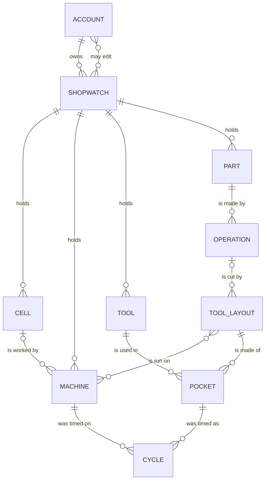

# Shopwatch — a MindMapShare plugin

A cycle-time stopwatch for the shop floor, arranged around the **tool layout** —
one machine, one part, one operation, numbered the way the floor asks for it —
over the records the times belong to: the parts being made and their operations,
the cells and machines they run on, and the tool crib. What it measures adds up
into a **value stream** for each part: its route across the floor, and the
process time at every step of it.

**A cycle time is only ever true of one tool, on one machine, doing one
operation.** That is the shape of the record:

- a **cell** is an area of the floor: the machines that work together, in the
  order the work moves through them. A machine belongs to one cell or to none
- a **tool** carries what is true of it wherever it runs — its own part number,
  what it is, how many cutting edges it has, and optionally what it costs
- a **part** carries its **operations**, and an operation belongs to exactly one
  part, because that is what an op is: a step in making *that* part, not a name
  that means the same thing everywhere
- a **tool layout** is the tooling for one operation and the **machines that run
  it**. It carries **a number of its own** — *run TL 12* — and its **pockets** are
  the tools in it, in the order they cut. One layout, several machines: two
  identical lathes running the same op off the same arrangement are one layout
  with both machines on it, not two that drift apart
- a **pocket** carries what is only true there: which station it sits in, how
  many of the tool's edges are **indexed through** it, and how many **parts run
  between one index and the next**
- a **cycle** is measured on a machine, so every recorded cycle names the one it
  was taken on. The same layout on two machines is one arrangement with two sets
  of times, and neither is averaged into the other

**The screen is arranged around the tool layout**: it is what the charts are of,
what the running order is within, what a PDF page is one of, and what everything
is filed under. It opens on the **floor** — the cells, the operations that run in
each, and under every operation the layout it is run as with its machines and its
pockets — and **nothing is pulled up until you press a machine or a pocket**.
Time enough cycles and the record answers the questions that are actually asked
at the machine:

- how long the layout really takes, on average, at best, and how far it spreads
- how much of the measured cycle is actually cut, and how much of it is not
- how long an edge lasts in minutes of cut, at the parts it runs between indexes
- how many parts a whole tool covers, how many tools a hundred parts consumes,
  and what they cost per part
- and, across the layout's tools in the order they cut, **where the cycle
  actually goes**

**Cutting time is measured, not typed.** There is nowhere to enter what a tool
*should* spend in cut, because a number somebody typed and a number somebody
measured are two answers to one question and only one of them is evidence. The
time in cut comes from marking the tool in and out at the machine, and every
figure worked out from it says so.

## Installing

This plugin is not part of MindMapShare. It is downloaded separately and put in
the app's `plugins/` folder:

```bash
node tools/install-plugin.js manufacturing            # from a copy that ships it
node tools/install-plugin.js ~/Downloads/plugin.zip   # from a download
```

Restart the server. **Shopwatch** then appears in the **Features** library, next
to the built-in screens; add it there and it joins your toolbar. Without it
installed, nothing about the app changes.

The folder and the plugin id are still `manufacturing`: the id is the URL prefix
for its API, and it is what every saved shopwatch is filed under, so renaming it
would orphan every one already saved. Only the name on screen is Shopwatch.

It needs a host that speaks **plugin contract v2** — the version that owns
documents, sharing and the live channel on an add-on's behalf. An older host
refuses to load it and says so at startup rather than half-installing it.

To take it off again: `node tools/install-plugin.js --remove manufacturing`.
Shopwatches stay on each account and come back if it is reinstalled — as does its
place in anyone's toolbar, which is kept rather than quietly dropped.

## Using it

**Start a shopwatch.** A shopwatch is one floor: its parts and their operations,
its machines, its tool crib, and every cycle timed against them. An account keeps
as many as it needs — one per cell, one per building, one per customer, one to
try something in — and the switcher at the top of the screen moves between them.
A new one is **yours and private** until you say otherwise.

Everything below happens inside the open shopwatch. Nothing crosses from one to
another except by [saving a copy](#sharing-a-shopwatch) or by exporting a
spreadsheet out of one and importing it into another.

**Add a part**, and give it the operations that make it:

| Field | What it is |
| --- | --- |
| Part number | The part being made, not the tool: `12345-A` |
| Description | What it is: "pump housing" |
| Operation | What the traveller calls the step: `Op 20` |
| Step | Where that op falls in making the part — 1 runs first |

**Add a cell**, if the floor is laid out in them. A cell is an area — *Cell 1 —
turning*, *the mill cell*, *the deburr bench* — and it holds the machines that
work together:

| Field | What it is |
| --- | --- |
| Cell | What that area of the floor is called |
| Flow order | Where the cell falls in the flow across the floor — 1 is first |

**Add a machine**, and say which cell it stands in and where the work reaches it
in that cell. Both are optional: a floor that is not laid out in cells works
exactly as it did, and a machine that belongs to no cell is listed on its own at
the end rather than being put in one it is not in.

**Add a tool.** A tool is described once, however many machines it ends up on:

| Field | What it is |
| --- | --- |
| Part number | The tool's own number — what it is ordered by: `CNMG432-MP` |
| Description | What it is: "80° CNMG rougher" |
| Cutting edges | Usable cutting edges the tool has — 4 on a CNMG insert |
| Cost | Optional — what one costs, for cost per part |

**Make a tool layout.** This is the thing the shopwatch times, and the thing the
floor asks for by name:

| Field | What it is |
| --- | --- |
| Tool layout number | What it is called on the floor — its own number in this shopwatch |
| Operation | Which op of which part it cuts |
| Machines that run it | Every machine set up with this same arrangement — tick as many as run it |
| Notes | Fixture, offsets, work stops: what the next person setting it should know |

**One layout, several machines.** Two identical lathes running the same op off
the same tooling are **one layout with both machines ticked**, not two layouts
that look alike — so a change to a pocket is one edit and reaches both, and a
second machine of the same kind joins by being ticked rather than by copying
anything. The cycles stay apart: each is measured on a machine, each remembers
which, and the screen shows the numbers for the machine you are standing at.

**A machine's cycles are its own, all the way down.** Under a pocket, **Recorded
cycles** is one machine's list — the machine the watch is on, named in the
heading when there is more than one. What is timed there is timed on it, what is
typed in by hand is added to it, and the **✕** deletes a cycle taken on it: the
other machine's history is not on the screen to be removed by mistake. Switching
machines switches the list, the count beside the heading and the numbering with
it. The cap is per machine too, so a machine run hard all week never pushes the
quiet one's history off the end.

**Put tools in its pockets:**

| Field | What it is |
| --- | --- |
| Tool | Which tool from the crib this is |
| Tool layout | Which layout this pocket belongs to |
| Pocket | Turret station or pocket it sits in: `T0303` |
| Seq | Where the tool falls in that layout's running order — 1 cuts first |
| Indexable edges | How many of the tool's edges get indexed through here |
| Parts per index | Parts run between one edge index and the next |

The same tool in a second layout gets its own times, its own edges and its own
tool life there — which is the point. A rougher that spends 38 seconds in cut on
Op 20 and 12 on Op 10 of the same part is one tool in two layouts, not two tools.

Leaving **indexable edges** blank means every edge the tool has. Adding a part
leads straight into its first operation, adding an operation into making the
layout that cuts it, and making a layout into filling its first pocket — because
a part with no ops, a layout with no tools and a machine with no layout are all
records that cannot tell you anything yet.

**Pick a tool to time it.** The floor lists the cells, the operations in each and
the layout each is run as. Pressing a **machine** on a layout says *I am at this
machine running this layout*, and the watch comes up on its first tool; pressing
a **pocket** puts the watch on that tool. **✕** puts it away again and gives the
screen back to the floor. Nothing is pulled up until you ask for it — an empty
stopwatch pointed at nothing is the biggest thing on a screen saying the least.

**Time it.** **Start** when the tool goes in, **Cycle done** at the end of each
part. Each press records the split since the last one, so a run of parts gives a
run of cycle times without stopping the watch. **Reset** zeroes the display and
keeps every recorded cycle.

**Mark it in and out of the cut.** A cycle time is everything — rapids, the
tool change, the bar feed, and the part of it actually cutting metal. Only the
last is the **cutting time** the tool life is worked out from, and it cannot be
read off a cycle time afterwards. So it is marked as it happens: press
**◻ Mark in cut** as the tool enters the material and again as it comes out.

Press it as many times as the tool enters and leaves within one cycle — the
stretches add up. What has accumulated shows under the clock while the cycle
runs, goes onto the cycle when it is recorded, and starts again from nothing for
the next one. A **paused watch is not cutting**: time through a pause is not
counted, and a tool still in the cut when you resume carries on from where it
was.

The measured figure then appears as **time in cut**, with what share of the
cycle it is and what the rest of that cycle went on, and each recorded cycle
shows its own.

That share is worked out over the cycles that were **actually marked**, not over
every cycle timed. Averaging the time in cut over the marked cycles and the
cycle over all of them would let a mostly-unmarked op come out more than 100%
cut, which would be arithmetic rather than anything that happened at the
machine.

**Cutting time comes from what was marked**, and failing that from the whole
measured cycle — which is an overestimate. The **min / edge** tile says which of
the two it used, so a tool life worked out from a whole cycle is never mistaken
for one worked out from real time in cut.

**Time the layout tool by tool.** A tool layout is a run of tools cutting one
after another, and **Tool done →** is the press for measuring each one's share of
it:
it records the split against the tool that has just finished cutting and moves
the watch to the next tool in the running order, **without stopping**. So the
next split starts the moment the last one ends, which is what actually happens
at the spindle. Press it down the whole layout and past the last tool it comes
back to the first — down the layout is one part, and the next part starts again
at tool 1.

Nothing is recorded by the move itself, and a press that times nothing moves
nothing: with the watch stopped, or on a double tap, the tool does not change.
It only appears on a layout with more than one tool set up; on a single-tool
layout it would be **Cycle done** under a name that promises more.

A few passes down the layout and the **Tool layout** panel fills in on its own —
each tool's average, its share of the total, and where the cycle actually goes.

**Fold the watch away.** The clock is deliberately huge — it has to be read
from an arm's length at the machine — which on a phone is most of the screen
spent on a number you are not always looking at. The **▾** on the watch folds it
down to a bar: which layout and which tool, the running time, and the presses a
cycle needs — **Cut**, **Start/Stop**, **Tool done →** and **Cycle done** — with
the layout, the tools and the lists it was covering now on screen underneath it.

Folding is not stopping. The watch keeps running, the panel still goes amber
while it does, the keys still work, and the time comes back with the watch when
you open it again — a measurement in progress is never thrown away by tidying
the screen. Like the folded lists, it is remembered on that device rather than
saved to the account, so folding the watch on the phone at the machine leaves
the office screen alone.

At a laptop, <kbd>Space</kbd> starts and stops, <kbd>L</kbd> marks a cycle,
<kbd>N</kbd> is **Tool done →**, <kbd>C</kbd> marks in and out of cut, and
<kbd>R</kbd> resets. A time measured
somewhere else is typed straight in as `42.6` or `1:23.4`.

The watch keeps time from the clock rather than counting up, so a phone that
sleeps mid-cycle, a backgrounded tab and a page reload all come back reading
correctly.

**Read the numbers.** From the parts per index on the setup, and the time marked
in cut (or, until anything is marked, the measured average):

```
parts per tool     = parts per index × indexable edges
minutes per edge   = parts per index × time in cut ÷ 60
tools / 100 parts  = 100 ÷ parts per tool
cost per part      = tool cost ÷ parts per tool
```

**Put the tools in running order.** Each setup carries a **Seq** — 1 cuts first —
within its tool layout. A newly set-up tool takes the next number automatically,
so entering tools in the order they run needs no thought; the ↑ / ↓ buttons on a
card move it a place either way afterwards, and the layout renumbers itself so
the sequence is always 1..n with no gaps. The lists, the charts, the PDF and the
CSV all follow that order, and the watch says which tool of how many you are
timing.

**See where the cycle goes.** The **Tool layout** panel is one layout's whole
measured cycle — the sum of every tool's average — with a stacked bar underneath
dividing it between the tools in the order they cut. Each segment
is one tool, sized by its share; the table below the bar names them, gives each
average and its percentage, and doubles as the legend. Hovering (or tabbing to)
either the bar or a row lights up the other, so a two-percent segment is still
reachable.

The segment fills come from a single cyan ramp stepped light→dark along the
running order, so the order is legible in the color itself rather than needing
eight unrelated hues. The ramp is checked against the dark chart surface for
monotone lightness, a visible gap between adjacent steps, one hue, and a darkest
step that still clears the surface.

A tool with nothing timed against it yet cannot contribute to the total, so it is
listed as **not timed** and a line under the chart says how many of the layout's
tools are in that state — the total is what has been measured, not the whole
layout. A layout with only one timed tool gets the figure without a bar; one
segment is not a part-to-whole story.

**See what is not cutting.** The **Tool layout** panel says which tool owns the
cycle. The **In cut, and the waste** panel under it answers the other question,
which is usually the more useful one: how much of each tool's cycle is making
chips.

It is one column per tool of the layout, side by side. A column is that tool's
measured cycle, drawn to a scale shared across the layout, and only the part of
it marked in the cut is filled in — so **the empty top of each column is the
waste**: the rapids, the tool change, the bar feed. The tool with the most air
above its fill is the one worth attacking, and because every column is on the
same scale, that comparison is a glance rather than a calculation. The figure
above the plot is the layout's own share, over the tools that were marked.

The fill is the app's in-cut hue and the unfilled part is a dark step of that
same hue, so cut and not-cut read as one measure rather than two subjects; the
pair is checked against the panel it is drawn on for monotone lightness, a
visible gap between the steps, one hue, and a dark step that still clears the
surface. Between the two is a 2px gap in the panel colour rather than a border —
white space is what separates the fills, the same as on the layout's cycle bar.

The most and least cut columns are labelled on the axis; every other number is
in the table under the plot, which gives each tool its time in cut, what was
wasted and its percentage, and doubles as the accessible twin of the plot.
Hovering or tabbing to either a column or a row lights up the other.

**A tool nobody marked in cut is not drawn as a column of waste** — that would be
a measurement nobody took. It is drawn as an outline with nothing in it, listed
as **not marked**, and counted in a line under the chart.

**The floor is the list.** It is the shop read the way it is walked: the
**cells** in flow order, the **machines** in each, the **operations** that run
there in the order the part is made, and under every operation the **tool
layout** it is run as — its number, its machines as buttons, and its pockets.
Under it, **Machines** is the same records read from one machine, **Parts and
operations** is the short list of what is being made, and **Tools** is the crib.
One filter box narrows all four, and it knows the names things are asked for by:
typing **TL 12** (or just **12**) asks for everything on that layout, and typing
a **cell's name** asks for everything in that cell.

**Searching for a machine gives its tool layouts, sorted by operation.** A
machine's name is the one word painted on the side of the iron, so it is what a
floor gets asked for. Type it in the filter box — or press the name on any
machine tag on the floor, which puts it there for you and takes you to the answer
— and the **Machines** list comes back narrowed to it: every layout set on that
machine, gathered under the **operation** it cuts, with the operations in the
order the part is made and the parts in name order. Two layouts on the same op
sit together under it in number order.

Sorted by operation rather than by layout number, because the number is only how
a layout is *called for* once you already know which one you want; what a machine
does is a sequence of operations. Every cycle shown under a machine is the one
measured **at that machine** rather than one averaged across every machine the
layout runs on — the layout's, each pocket's, and the recorded cycles when you
open one — and pressing a pocket there puts the watch on that tool, at that
machine, the same sentence the floor's machine buttons say, arrived at from the
other end. Read from the floor, where a layout is under its cell rather than
under one of its machines, a pocket shows what it measures across all of them,
which is the honest answer to a question asked of all of them. Ask with a part number, a tool number or **TL 12** instead and the
list turns around and answers with the machines that cut it.

**Each cell is its order of operations.** Opening a cell lists the operations
that run in it in the order the part is made, and under each the layout that cuts
it. That is the order of operations for that cell, and it is one lane of the
value stream below.

**The screen opens closed.** Every heading on it folds — the four lists, each
cell, each machine and each part inside them, the tool layout panel, the
cut-and-waste panel, the value stream, the recorded cycles and the stopwatch
itself — and all of them start closed, so a floor of a dozen machines and four
hundred cycles opens as a page of headings rather than as a wall. What a closed
heading carries is the answer without the working: the layout's number and its
measured cycle, what share of that cycle is in cut, the part's process time, a
machine's tool count, a cell's machines and the routes through it. The stopwatch
closed is still a stopwatch — the time, and the presses a cycle needs.

A layout is **one layout wherever it is read**, so opening TL 12 under its
machine opens it on the floor too — the fold belongs to the layout, not to the
list it was pressed in.

What is kept on the device is what you have **opened**, not what you have closed,
so it stays that way: a machine or a part added next week arrives closed like
everything else, instead of the screen quietly getting longer every week. It is a
view preference, not part of the shop record, so it is not saved to the account
and never reaches anyone else. **A filter outranks a fold**: searching opens
everything, because a screen that hid the answer it was just asked for would be
worse than useless. The watch is the one exception, since a running stopwatch is
never the answer to a search.

Deleting a machine takes its setups and leaves the tools in the crib; deleting a
tool takes it out of every setup it was in; deleting an operation takes the
setups that were for it, because the cycles timed belong to the op. All of them
say exactly what will go before they do it.

**Clone a machine** when a second one of the same kind arrives. **Clone** on a
machine opens a new machine already carrying its number's successor — `MC-101`
suggests `MC-102`, `Lathe 3` suggests `Lathe 4`, and a name ending in anything
else gets a number put on the end — and saving copies **the tools** across, in the
stations they sit in. The suggested number is only a suggestion; type over it
before saving if the machine is called something else.

By default it copies the tooling and nothing else, because nothing else is a fact
about the machine. A tool that cuts three operations on the original comes across
once, as one tool in one station; **which operations the new machine runs is its
own business**, and the indexable edges and the parts between indexes are both
facts about the op being cut. The clone therefore lists its tools under **No
operation set** until each is put on one — which is a setup like any other, and
the point at which it becomes something the watch can time.

**Bring the operations too** — the tick box on the clone form — when the second
machine is standing in for the first and running the same work. Each setup then
arrives whole: the same tool, in the same station, on the same operation, with
the indexable edges and tool life worked out for it, and the op ends up listing
both machines. That is a claim about the new machine — that it cuts the same op
the same way — so it is asked for rather than assumed, and
the form says which of the two it is about to do before you save.

The **recorded cycles** stay with the original either way: a cycle time is a
measurement taken on one machine, and carrying it onto another would be inventing
data about a machine nobody has stood in front of.

**Clone a part number** when a revision comes through, or a second number is made
the same way. **Clone** on a part opens a new part number already carrying its
successor — a revision letter takes the next letter, so `12345-A` suggests
`12345-B` and `778-C` suggests `778-D`; a number ending in digits takes the next
number the way a machine does; anything else gets a number put on the end. As
with a machine, the suggestion is only a suggestion.

Saving copies **the whole route**: every operation of the part, and every setup on
each of them — the same tools, on the same machines, in the same stations, with
the indexable edges and the parts between indexes worked out for them. So `12345-B` arrives running Op 10 and Op 20 on the same machines with
the same tooling, and the work left is whatever is actually different about it.

Unlike a cloned machine, none of that is optional, because the two cases are not
alike. Which operations a machine runs is a decision about the machine — so it is
asked. The operations that make a part *are* the part; a part number cloned
without them would be a new part number and nothing else, which **+ Part**
already does.

The **recorded cycles** stay with the original here too: they were measured making
that part, on parts that were actually cut, and a number nobody has run yet has
nothing to show. So the clone reads as ops and tools with no measured time
against them, which is exactly what it is until somebody stands at the machine.

## The value stream

A part is made by its operations in order; each of those runs on a machine, which
stands in a cell; and every one of those steps has a measured cycle underneath
it, because the tools on it have been timed. Put end to end, that is the value
stream — where the part goes, in what order, and how long each step takes — and
the **Value stream** panel draws it from what the record already holds. Nothing
is entered for it.

**The map** is a box per operation in the order they run, banded by the cell the
step happens in, with an arrow between boxes and the handover from one cell to
the next where the band changes. Each box carries the step number, the operation,
the tool layout it runs as, the machine, the **measured cycle** for that layout,
how many tools are on it, what share of that cycle is in cut and what share of
the part it is. Under the boxes, the part's process time divided between its
steps on the same light→dark ramp the tool layout bar uses, and a table giving
every step as text — including the ones with nothing measured and the ones with
no machine set up yet.

**Where an operation runs on more than one machine**, those are alternative
routings rather than two steps: the boxes sit side by side in the one step, the
one the total takes is outlined, and the total takes the **fastest measured** of
them. The panel says so rather than leaving you to work out which it used.

**It draws only what has been measured.** A value stream map normally carries
inventory between the boxes, changeover, uptime and a lead-time ladder — none of
which is in this record, so none of which is drawn. Inventing it would make the
map look finished and be wrong, which is worse than a map that says plainly what
it is: **process time**, step by step, cell by cell, measured at the machine.
Steps with nothing timed against them are listed as such, with a line saying how
many, so the total reads as the process time measured so far rather than as the
whole part.

**🖨 PDF** on the panel prints it: the route across its cells, the process time by
step, the table, and a **Scope** block spelling out what the map does not claim —
which matters more on paper than on screen, because a page with no caveat on it
gets read as the whole picture.

## The tool layout, on paper

A shop runs off a **tool layout sheet**: one page, one layout, every pocket on it
and what goes in each. **🖨 PDF** is that sheet, made out of what the shopwatch
already knows — so it carries the measured cycle and the time in cut alongside
the tooling, which a typed-up sheet never does.

**One tool layout per page**, in number order, laid out the way the screen lays
one out:

- the **number** and the whole address — the machine, the part, the op — across
  the top, under a *Tool layout sheet* label
- **Cycle by tool**: the stacked bar dividing the measured cycle between the
  tools in the order they cut, on the same light→dark ramp the screen uses, with
  the table under it naming each one and giving its average and its share
- **Cutting time and waste**: the same tools as columns, each the tool's measured
  cycle with only the marked-in-cut part filled in, every column on one scale
- **Tooling, in cutting order**: a row per **pocket** — the tool in it, its own
  part number, cycles timed, average, time in cut and what share that is,
  indexable edges, parts per index, parts per tool and minutes per edge — with
  whatever was written about that setup underneath its row
- the **Notes** on the layout, the op, the part and the machine
- and a footer carrying the mark, the shopwatch, the layout it is a sheet of and
  when it was issued — so a page that ends up taped to a machine can be traced
  back to the record it came off, and told from the one printed last month

The 🖨 PDF on the top bar prints **every** layout in the shopwatch; the **PDF**
on the Tool layout panel prints the one you are looking at. Both open a
print-ready page and hand it to the browser, where *Save as PDF* is one of the
choices in the print dialog and a printer is the other — the same page goes
straight onto paper for the machine. Nothing is uploaded and no library is
fetched; it is the browser's own printing, so it works offline and the file never
leaves the device.

A tool that is on a machine but on no operation is on no layout, so it is on no
page — and rather than leave it quietly out of a sheet somebody is about to work
from, the message that opens the print dialog says how many are in that state.

Reading a shopwatch and printing it are the same permission, so **a read-only
shopwatch gets the PDF too**: send somebody a link and they can print the layouts
without being able to change a number in them.

*(Pockets are the spine of that table, which is where the tool holder and the
insert in each one will hang as those become records of their own.)*

## Sharing a shopwatch

A cycle time is worth more to the people who did not take it. **Share** on the
doc bar is where a shopwatch stops being only yours, and it asks two separate
questions, because they have different answers.

**Who can open it** — one of three:

| | |
| --- | --- |
| **Private** | Only you, and anyone you invite to edit. This is where every shopwatch starts. |
| **Friends** | The people you are friends with in the app can open it, and it appears in their feed. |
| **Everyone** | Anyone with the link can open it, and it can be found in Discover. |

**Who can change it** — a list of usernames, and it is a separate question
because it *overrides* the tier: an invited editor can open a **private**
shopwatch, time cycles in it and talk in it. That is how you hand the job to the
person setting it, without publishing the shop to anybody else. Up to 20 people
per shopwatch.

Everyone else who can open it gets it **read only**: the doc bar says so, and the
screen simply never writes — no half-saved edit, no error after the fact. What
they *can* do is **Save a copy**, which takes the whole record into a private
shopwatch of their own, to change without touching yours.

**Work in it together.** Two people with the same shopwatch open see each other's
edits as they happen — a cycle timed at the machine appears on the office screen
without a reload, and the doc bar says how many people are in here. This is the
same live channel the mind maps use. A time being typed in is never overwritten
by someone else's save mid-keystroke: the incoming version is held until yours
has gone.

**Say something about it.** 💬 opens the shopwatch's chat. Everyone who can open
the shopwatch reads it; everyone who can change it can post. Edits post
themselves into it — *timed 80° CNMG rougher at 00:33.3 on HAAS ST-20* — so the
chat doubles as the log of what happened to the floor, and a question asked in it
reaches whoever is in there without leaving the screen. The last 400 messages are
kept.

**In the feed.** A friends-or-everyone shopwatch gets a card in the feed of the
people who can see it, saying what is in it — *3 parts · 3 machines · 3 tools ·
12 cycles timed* — and opening the card opens the shopwatch. Making one public,
being invited to edit one, and a cycle being timed in one you are in all send the
usual notification.

**Copy link** hands you the shopwatch's address. It is not a magic link: whoever
opens it still has to be allowed to see it, so sending a private shopwatch's link
to somebody shows them nothing until you invite them.

**A link to an *Everyone* shopwatch needs no account at all.** Send it to a
customer, an auditor, a machine builder — anyone — and it opens for them signed
out: the parts and their operations, the machines, the tool crib, the tool
layouts and their charts, and every cycle recorded, exactly as you see them. It
is genuinely read only, and not by disabling things — the stopwatch itself, the
setup forms, the layout numbering, the add and delete controls and the reorder
arrows are simply not drawn, so nothing on the screen looks live and does
nothing. The clock goes with them: one that can never move is as dead as a
button that does nothing, so a reader gets the layout named and the numbers under
it instead. What they do get besides the floor is **⤓ Export** and **🖨 PDF** —
reading a floor, downloading it and printing it are the same permission — and a
way to sign in and start one of their own.

Friends-only and private shopwatches stay shut to signed-out visitors, and no
part of the add-on other than that one address opens without an account — not
the list of shopwatches, not the chat, not the live channel. Remember what
*Everyone* means in full, though: **anyone with the link, and discoverable** —
it also puts a card in Discover. Use *Friends* or an invited editor for a floor
that should reach particular people and nobody else.

**Delete shopwatch** takes it and everything in it, and says how many cycles that
is before it does. Anyone you shared it with loses it too.

### Moving a floor into another shopwatch

**Duplicate**, on the doc bar, stands a second shopwatch up beside the open one
holding everything it holds — the parts and their operations, the machines, the
tool crib and every cycle timed. It is private to you whatever the original was,
and the two are separate from that moment: changing one leaves the other alone.
Useful for a second bay set up like the first, a what-if you do not want in the
real record, or a copy to hand to somebody.

On a shopwatch somebody else shared with you, the same button reads **Save a
copy** — the same move, and the only way to work in a floor you can open but not
change.

To bring a floor into a shopwatch that already has one, go through a
spreadsheet instead: **⤓ Export** the first, open the second, **⤒ Import** the
file. That merges rather than replaces — the preview says what is new before
anything happens, and matching records are filled in rather than duplicated.

## Spreadsheets, in and out

**⤓ Export** downloads every recorded cycle, one row each, carrying the tool
layout it was measured on and the part, the operation, the machine, the tool and
the setup that make up that layout — in layout order, and within a layout in the
order the tools cut. A pocket on a layout two machines run is **a row group per
machine**, each carrying that machine's own cycles and its own average, because
that is where they were measured; every cycle is written once. A part with no
operations, an operation nothing is set up for, a tool in the crib and an idle
machine each get a row of their own, so the file is the whole record rather than
only the parts that have been timed.

**⤒ Import** reads one back, into the open shopwatch — or, with none open, into a
new one named after the file. It is the same shape the export writes, so a file
that came out of here goes back in unchanged — and a tool list somebody already
keeps in a spreadsheet can be brought in by putting these headers on it:

```
cell, tool_layout, machine, machine_notes, part, part_description, part_notes,
op, op_notes, seq, station, tool_part_number, tool_description, cutting_edges,
tool_cost, tool_notes, indexable_edges, parts_per_index, notes,
cycle_seconds, cycle_cut_seconds, recorded_at
```

Columns are read **by name, not by position** — reorder them, leave out the ones
that do not apply, or use a common alternative (`tl`, `layout`, `work cell`,
`area`, `machine name`,
`part number`, `operation`, `turret`, `pocket`, `tool no`, `description`,
`edges`, `cut time`, `parts between indexes`, `seconds`, `date`) and it still
reads. A row makes
whatever it names: a part, an operation of it, a machine, a tool, the setup
joining them, and a cycle timed against it. A file needs at least one column
naming a part, a machine or a tool. Each record that can carry notes has its own
notes column, so a machine's notes and a setup's never overwrite one another;
plain `notes` is the setup's. An op named with no part gathers under one part
called **Unassigned** rather than each row inventing one. The three worked-out
columns the export adds — cycles timed, average, parts per tool — are ignored on
the way in: they come from the cycles, and a stale figure in a spreadsheet should
not be able to contradict the times it was supposed to summarize.

**Older files still read.** From version 1: `insert` is taken as the tool's part
number, `indexes_per_insert` as its cutting edges, and a tool life given in
cutting minutes per edge is turned into parts between indexes at the cycles in
the file itself, which is the same division version 1 did on screen. A life with
no cycles to divide by is left out rather than guessed at, and the preview says
how many.

Quoted fields, commas and newlines inside them, semicolon-separated files from
non-English spreadsheets, comma decimals (`10,5`) and Excel's byte-order mark all
read as you would expect.

**An import never deletes anything.** Choosing a file shows what it would do —
how many parts, operations, machines, tools and setups are new, how many are
already there, how many cycles would be added — and nothing happens until you say
Import. A part is matched by number, an operation by its name within that part, a
machine by name, a tool by its part number and description, and a setup by the
machine, tool and operation it joins plus the pocket it sits in; each gains any
field the file fills in and keeps everything it leaves blank. **`cell`** is matched by name and made if it is not there, and the machine on
that row is put in it. **`tool_layout`** names the layout: rows carrying the same
number, tool and pocket are **one pocket on one layout** however many machines
they name, and each machine named for that number joins it. So a layout two
machines run goes out as two row groups and comes back as the one layout with
both machines on it, each keeping the cycles it was measured on — not two
layouts that look alike. A number another layout already answers to on a
different operation is left alone rather than taken off it, and a file with no
layout numbers at all still reads, with each machine keeping a pocket of its own.
Cycles are recognized by the machine they were taken on, when they were recorded
and how long they took, so **importing the same file twice adds nothing the
second time**.

## Coming from an earlier version

Records are converted the first time they are read, in steps that each undo one
shape the record used to have. Nothing is discarded and no number is invented.

**Version 1** kept one flat record per tool, with the machine as a field on it —
so the same tool on two machines was two unrelated records and nothing linked
them. Each old record becomes a machine, a tool and the setup between the two;
tools met twice under the same insert designation and description collapse into
one crib entry with a setup on each machine. The insert designation becomes the
tool's part number, indexes per insert its cutting edges, and the tool life in
minutes per edge becomes parts per index at that measured cycle. Where nothing was timed there is no cycle to divide by,
so the old figure is carried into the setup's notes rather than turned into a
number nobody measured — as is an inserts-per-op count above one.

**Version 2** kept the part and the op as text on that link, repeated on every
tool of the job. They become records: a part, and the operations belonging to it,
with each setup naming the operation it is for. A setup that named neither gets
no operation rather than an invented one, and says so on screen until one is
chosen; an op named with no part gathers under a part called **Unassigned**.

**Version 3** kept a cutting time typed onto the setup beside the one measured at
the machine. Two answers to one question, only one of them evidence: the typed
one goes into that setup's notes rather than being thrown away, and the measured
one stands alone.

**Version 6** tied a layout to exactly one machine — the pair `(machine,
operation)` *was* the layout — so identical machines each had one and the same
arrangement was typed twice. Each old pair becomes a layout with one machine on
it, every setup moves onto the layout it was part of, and each cycle keeps the
machine it was measured on. Nothing is merged: two machines that ran the same op
stay two layouts, because nobody has said their tooling is the same, and saying
so is a decision the floor makes by ticking a machine onto a layout. Setups that
named a machine but no operation had no layout at all; they get one — that
machine, no operation — which is the state they were already in.

**Version 5** had no cells: a machine stood on its own and the floor had no
areas. Nothing is invented for it — a record read in comes back with no cells and
every machine outside one, which is exactly the floor it described, and the lists
read as they did. Making a cell and putting machines in it is the only thing that
changes that.

**Version 4** had no tool layouts, because the machine-and-operation pair was
only ever implied by the setups on it. Every pair with a tool on it becomes a
numbered layout — machine by machine, and within a machine in the order the ops
run, which is the order somebody numbering them by hand would have used. Nothing
about the floor changes: the same pairs were already what the charts and the
running order were per, and they now have a name to be asked for by. The numbers
are yours to change from that point on.

## The record, as a relational schema

The record is stored as one JSON document per shopwatch (see below), but it is
relational in shape and worth reading that way. Eight entities inside the
shopwatch, and one junction doing most of the work:



```sql
CREATE TABLE shopwatch (            -- one floor, and who may see it
  id          text PRIMARY KEY,
  owner_id    text NOT NULL REFERENCES account(id) ON DELETE CASCADE,
  title       text NOT NULL CHECK (length(title) <= 80),
  visibility  text NOT NULL DEFAULT 'private'
              CHECK (visibility IN ('private', 'friends', 'public')),
  created_at  timestamptz NOT NULL,
  updated_at  timestamptz NOT NULL
);
CREATE INDEX ON shopwatch (owner_id, updated_at DESC);
CREATE INDEX ON shopwatch (visibility, updated_at DESC);   -- the feed

CREATE TABLE shopwatch_editor (     -- invited to change it, whatever the tier
  shopwatch_id text NOT NULL REFERENCES shopwatch(id) ON DELETE CASCADE,
  account_id   text NOT NULL REFERENCES account(id)   ON DELETE CASCADE,
  PRIMARY KEY (shopwatch_id, account_id)
);

CREATE TABLE shopwatch_message (    -- the chat, and what was done to the floor
  id           text PRIMARY KEY,
  shopwatch_id text NOT NULL REFERENCES shopwatch(id) ON DELETE CASCADE,
  account_id   text     NULL REFERENCES account(id)   ON DELETE SET NULL,
  body         text NOT NULL CHECK (length(body) <= 400),
  kind         text NOT NULL DEFAULT 'said' CHECK (kind IN ('said', 'did')),
  at           timestamptz NOT NULL
);
CREATE INDEX ON shopwatch_message (shopwatch_id, at DESC);

CREATE TABLE cell (                 -- an area of the floor
  id           text PRIMARY KEY,
  shopwatch_id text NOT NULL REFERENCES shopwatch(id) ON DELETE CASCADE,
  name         text NOT NULL CHECK (length(name) <= 60),
  seq          int  NOT NULL DEFAULT 0 CHECK (seq BETWEEN 0 AND 999),  -- flow order
  notes        text NOT NULL DEFAULT '' CHECK (length(notes) <= 400),
  created_at   timestamptz NOT NULL,
  updated_at   timestamptz NOT NULL
);
CREATE UNIQUE INDEX ON cell (shopwatch_id, lower(name));

CREATE TABLE machine (              -- what is on the floor
  id           text PRIMARY KEY,
  shopwatch_id text NOT NULL REFERENCES shopwatch(id) ON DELETE CASCADE,
  cell_id      text     NULL REFERENCES cell(id) ON DELETE SET NULL,
  cell_seq     int  NOT NULL DEFAULT 0 CHECK (cell_seq BETWEEN 0 AND 999),
  name         text NOT NULL CHECK (length(name) <= 60),
  notes        text NOT NULL DEFAULT '' CHECK (length(notes) <= 400),
  created_at   timestamptz NOT NULL,
  updated_at   timestamptz NOT NULL
);
CREATE UNIQUE INDEX ON machine (shopwatch_id, lower(name));
CREATE INDEX ON machine (cell_id, cell_seq);   -- the flow through a cell

CREATE TABLE tool (                 -- the crib: true wherever the tool runs
  id            text PRIMARY KEY,
  shopwatch_id  text NOT NULL REFERENCES shopwatch(id) ON DELETE CASCADE,
  part_number   text NOT NULL DEFAULT '' CHECK (length(part_number) <= 60),
  description   text NOT NULL DEFAULT '' CHECK (length(description) <= 80),
  cutting_edges int  NOT NULL DEFAULT 0 CHECK (cutting_edges BETWEEN 0 AND 64),
  cost          numeric NOT NULL DEFAULT 0 CHECK (cost BETWEEN 0 AND 100000),
  notes         text NOT NULL DEFAULT '',
  created_at    timestamptz NOT NULL,
  updated_at    timestamptz NOT NULL,
  CHECK (part_number <> '' OR description <> '')   -- something to know it by
);

CREATE TABLE part (                 -- what is being made
  id           text PRIMARY KEY,
  shopwatch_id text NOT NULL REFERENCES shopwatch(id) ON DELETE CASCADE,
  number       text NOT NULL DEFAULT '' CHECK (length(number) <= 60),
  description  text NOT NULL DEFAULT '' CHECK (length(description) <= 80),
  notes        text NOT NULL DEFAULT '',
  created_at   timestamptz NOT NULL,
  updated_at   timestamptz NOT NULL,
  CHECK (number <> '' OR description <> '')
);
CREATE UNIQUE INDEX ON part (shopwatch_id, lower(number)) WHERE number <> '';

CREATE TABLE operation (            -- a step in making one part
  id         text PRIMARY KEY,
  part_id    text NOT NULL REFERENCES part(id) ON DELETE CASCADE,
  name       text NOT NULL CHECK (length(name) <= 40),
  seq        int  NOT NULL DEFAULT 0 CHECK (seq BETWEEN 0 AND 999),
  notes      text NOT NULL DEFAULT '',
  created_at timestamptz NOT NULL,
  updated_at timestamptz NOT NULL
);
CREATE UNIQUE INDEX ON operation (part_id, lower(name));

CREATE TABLE pocket (               -- one tool in one pocket of one layout
  id              text PRIMARY KEY,
  layout_id       text NOT NULL REFERENCES tool_layout(id) ON DELETE CASCADE,
  tool_id         text NOT NULL REFERENCES tool(id)        ON DELETE CASCADE,
  station         text NOT NULL DEFAULT '' CHECK (length(station) <= 20),
  seq             int  NOT NULL DEFAULT 0 CHECK (seq BETWEEN 0 AND 999),
  index_edges     int  NOT NULL DEFAULT 0 CHECK (index_edges BETWEEN 0 AND 64),
  parts_per_index int  NOT NULL DEFAULT 0 CHECK (parts_per_index BETWEEN 0 AND 100000),
  notes           text NOT NULL DEFAULT '',
  created_at      timestamptz NOT NULL,
  updated_at      timestamptz NOT NULL
);
CREATE INDEX ON pocket (layout_id, seq);   -- the running order

CREATE TABLE tool_layout (          -- the tooling for one operation
  id           text PRIMARY KEY,
  shopwatch_id text NOT NULL REFERENCES shopwatch(id) ON DELETE CASCADE,
  operation_id text     NULL REFERENCES operation(id) ON DELETE SET NULL,
  number       int  NOT NULL CHECK (number BETWEEN 1 AND 9999),
  notes        text NOT NULL DEFAULT '' CHECK (length(notes) <= 400),
  created_at   timestamptz NOT NULL,
  updated_at   timestamptz NOT NULL
);
CREATE UNIQUE INDEX ON tool_layout (shopwatch_id, number);  -- a number names one layout

CREATE TABLE tool_layout_machine (  -- the machines that run it
  layout_id  text NOT NULL REFERENCES tool_layout(id) ON DELETE CASCADE,
  machine_id text NOT NULL REFERENCES machine(id)     ON DELETE CASCADE,
  PRIMARY KEY (layout_id, machine_id)
);

CREATE TABLE cycle (                -- one part, timed, on one machine
  id         text PRIMARY KEY,
  pocket_id  text NOT NULL REFERENCES pocket(id)  ON DELETE CASCADE,
  machine_id text     NULL REFERENCES machine(id) ON DELETE SET NULL,
  sec        numeric NOT NULL CHECK (sec > 0 AND sec <= 86400),
  at         timestamptz NOT NULL,
  note       text NOT NULL DEFAULT '' CHECK (length(note) <= 80)
);
CREATE INDEX ON cycle (pocket_id, machine_id, at DESC);

CREATE TABLE shop (                 -- one row per shopwatch: what the watch is on
  shopwatch_id    text PRIMARY KEY REFERENCES shopwatch(id) ON DELETE CASCADE,
  active_setup_id text NULL REFERENCES setup(id) ON DELETE SET NULL,
  version         int NOT NULL,
  updated_at      timestamptz NOT NULL
);
```

**`tool_layout` is the arrangement, and `tool_layout_machine` is where it runs.**
Splitting the machines out of the layout is what lets two identical machines
share one: the pockets hang off the layout, so a change to the tooling is one
row, while the machines are a set that can grow by one insert. `number` is the
only thing on a layout that is a decision rather than a reading — everything else
is an aggregate over its pockets — and its unique index is the whole of its
integrity: a number names exactly one layout.

**`pocket` is the junction now.** It ties a tool to a layout and carries what is
true only there: `index_edges` and `parts_per_index`. A tool in two layouts is
two rows with two tool lives, which is why the same insert can be a rougher on
one op and a finisher on another without either figure moving.

**`cycle.machine_id` is what keeps a shared layout honest.** A measurement
belongs to the machine it was taken on, so a layout run on two machines has two
sets of cycles under the same pocket and the screen reads whichever machine you
are standing at. It is nullable because a cycle recorded before layouts could be
shared has no machine on it — at the time there was only one — and those answer to
any machine rather than to none.

`operation_id` is nullable too: tooling can be laid out before anybody says which
op it cuts, and deleting an operation leaves its layouts standing on their
machines with nothing named to cut, which is a state the floor can see and fix.
Nothing derived is stored — averages, spread, parts per tool, minutes per edge,
tools per hundred and cost per part are all computed from these columns, so no
stale figure can contradict the cycles it came from.

Natural keys, used to match records when a spreadsheet is imported: machine by
`lower(name)`; tool by `(lower(part_number), lower(description))`; part by
`lower(number)`; operation by `(part_id, lower(name))`; tool layout by the
operation and machine a row names — never by its number, which is a name rather
than an identity and is taken from a file only where it is free; pocket by
`(layout_id, tool_id, lower(station))`; cycle by `(pocket_id, at, sec)`, which is
what makes importing the same file twice a no-op.

**`shopwatch` is the sharing boundary.** Everything on the floor hangs off one
row of it, which is what makes a shopwatch shareable as a unit: `visibility`
answers who may open it, `shopwatch_editor` answers who may change it, and the
second overrides the first — an editor row lets somebody into a private
shopwatch, which is the point of having two questions. Nothing below `shopwatch`
carries a permission of its own, so there is no way for a machine or a cycle to
end up visible to somebody the shopwatch is not.

**Nothing about the value stream is stored**, because all of it is already here:
a part's steps are its operations by `seq`, where each runs is `tool_layout`,
which cell that is in is `machine.cell_id`, and how long the step takes is the
sum of the averages of the cycles on that layout. The map is a read of those four
tables, which is why it can never disagree with the times it was drawn from.

`cell_id` is nullable for the same reason `operation_id` is: not every floor is
laid out in cells, a machine can stand outside them, and deleting a cell takes
the grouping rather than the machines.

Row caps, enforced on every write: 40 shopwatches per account, 20 editors and 400
messages per shopwatch, and within one shopwatch 40 cells, 60 machines, 200 tools,
120 parts, 300 operations, 200 tool layouts, 20 machines per layout, 200 pockets,
300 cycles per pocket **per machine** — and 900 for a pocket across every machine
it runs on. What drops when a machine is full is that machine's own oldest cycle;
when the pocket is full it is the machines holding the most that give up first,
down to an equal share, so a short history is never spent on a long one.

## What it stores, and where

Every shopwatch is saved on the account that made it, in the same database as the
rest of the app. A shopwatch is **private until its owner shares it**, and what
sharing does is exactly what the Share panel says: a friends or public tier lets
those people open it and puts a card in their feed, and an invited editor can
open and change it whatever the tier is. Nothing is sent outside the app either
way. Shopwatches are included in **Settings → Export my data**, and they are
deleted with the account — including for the people they were shared with.

## How it is put together

```
plugin.json          the manifest the app reads at startup
server.js            what an empty floor is, and what a stored one may contain
                     (no routes — the host serves every document itself)
public/client.js     the Shopwatch screen, and the mark in its top left corner
public/client.css    its styles, scoped under .mf-root
```

The mark is a stopwatch whose hand is a cutting insert — the two things the
screen is about, in one shape — drawn as an inline SVG in `client.js` rather than
shipped as a file: nothing to fetch, nothing to keep a second copy of at another
size, and it takes the palette with it, since the mark is `currentColor` and the
pivot is punched out in the page colour. The name beside it splits the way the
app's own does, **Shop**·*watch*.

It goes **in the app's top bar**, at the left of the account's toolbar, through
the slot the host offers the screen that is open (`ctx.brand`) — the same slot
the host's own screens are named in, so the bar always says which page you are
looking at. The bar has the room and the screen has better things to do with a
row of its own. Leaving Shopwatch hands the slot straight back. A host that
offers no such slot gets the mark drawn on the page instead, exactly as before,
so the add-on still runs on one. The same mark signs the footer of every printed tool
layout sheet. Nothing sits under it either way: a line of copy saying what the
screen is for is for somebody who has not opened it yet.

Sharing is not implemented here. `server.js` exports a `docs` contract — an empty
record, a `sanitize` that rebuilds one, and a one-line `summary` for the feed —
and the host owns the envelope around it: who a shopwatch belongs to, who may
open it, who may change it, its live channel, its chat and its feed card. So this
add-on has no permission code of its own to get wrong, and the routes under
`/api/plugins/manufacturing/docs/...` are the host's, the same ones any add-on
gets.

**It mounts no routes of its own at all.** `server.js` returns `docs` and nothing
else — no `handle` — so `/api/plugins/manufacturing/…` answers 404 for anything
that is not a document route. Every floor lives in a shopwatch, and the private
per-account store this add-on used before shopwatches existed is neither read
nor written.

`sanitize` rebuilds every field of what a client sends before it is stored, drops
any operation whose part is gone, any setup whose tool or machine is gone and any
tool layout whose pair is gone or has no tools left on it, numbers every pair that
has tools and none, gives a duplicated number away to the first layout claiming
it, and holds the record to sensible limits (120 parts, 300 operations, 60
machines, 200 tools, 200 setups, 200 tool layouts, 300 recorded cycles per machine
on a pocket and 900 across it) — the same guard whether the record
came from its owner or from somebody they invited. The client owns the state on
screen and autosaves it; a recorded cycle is sent at once rather than on the
debounce, because it is the one thing here that cannot be retyped from memory. A
save is skipped entirely on a screen that may only read.
